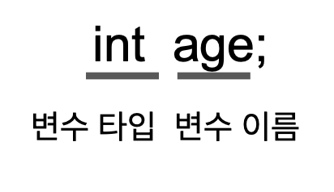
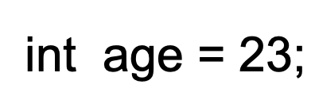
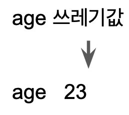
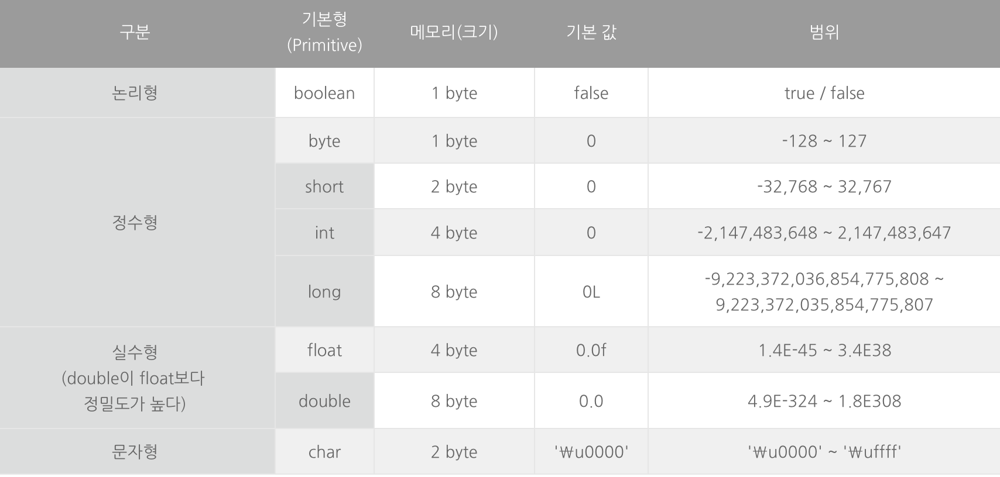

# 변수 - 2단원

## 1. 변수와 상수

### 변수란?

> 단 하나의 값을 저장할 수 있는 메모리 공간
>

### 변수의 선언과 초기화

- 변수 선언

    


변수 타입 - 정수형, 실수형, 문자형 등 다양한 타입 제공

변수 이름 - 메모리 공간에 이름을 붙여줌 → 값을 저장하고, 저장된 값을 읽어오는데 사용

변수 선언시, 메모리의 빈공간 ‘변수타입'에 알맞는 코기의 저장공간 확보 → 이 공간은 ‘변수 이름'으로 사용 가능

- 변수 초기화

    


> 변수를 사용하기 전에 처음으로 값을 저장하는 것
>

메모리는 공유하는 자원 → 다른 자원이 쓰고 남아있는 쓰레기값이 들어있을 수 있음

대입연산자를 통해 변수 초기화



## 2. 변수의 타입

### 기본형(primitive type) 변수

- 논리형(boolean), 문자형(char), 정수형(byte, short, int ,long), 실수형(float, double) 계산을 위한 실제 값을 저장 - 8개
- 기본형 종류


- JVM Runtime Data Area의 Stack 메모리에 저장된다.
- 논리형 (boolean) : true/false의 값으로, 조건식과 논리적 계산에 사용한다.
- 문자형 (char) : 문자를 저장하는데 사용되며, 변수에 하나의 문자만 저장할 수 있다.
- 정수형 (byte, short, **int**, long) : 정수를 저장하며, 주로 기본형 int를 사용한다.
- 실수형 (float, **double**) : 실수를 저장하며, 주로 기본형 double을 사용한다.

### 참조형(refrence type) 변수

- 객체의 주소를 저장 - 8개 제외 나머지 타입 → 클래스와 같은
- Heap 메모리에 저장된다.
- `Java.lang.Object`를 상속받은 값으로 기본형이 아니면 모두 참조형 변수이다.
- 참조형 변수를 선언할 때 변수의 타입으로 클래스의 이름을 사용하므로, 클래스의 이름이 참조변수의 타입이 된다.
`Date today = new Date();`

### 상수와 리터럴

> 상수 = 변수(값을 저장할 수 있는 공간) + 한번 값 저장하면 변경 x
>

`final int MAX_SPPED=10;` → 키워드 final

변수 쓰면 되는데 왜 상수 쓰는데?

→ 의미 있는 이름을 부여해 코드 이해 / 코드 수정시 상수값만 수정하면 됨 수정 용이

> 리터럴 = 그 자체로 값을 의미
>


- long 타입의 리터럴에 접미사 'L'을 붙인다.
- float 타입의 리터럴에 접미사 'f'를 붙인다.

```
// 정수 26을 표현하는 여러 방법
int num = 26;		// 10진법. 일반적인 형태
int octNum = 032;	// 0으로 시작하면 8진법.
int hexNum = 0x1a;    // 0x로 시작하면 16진법.
int binNum = 0b11010;	// 0b로 시작하면 2진법.
long longNum = 26L;	// long 타입.
```

*cf. 타입의 불일치*

*리터럴의 타입은 저장될 변수의 타입과 일치하는 것이 일반적이지만,*

*타입이 달라도 저장범위가 **넓은 타입에 좁은 타입의 값을 저장하는 것**이 허용된다.*

`int i = 'A';    // 문자 'A'의 유니코드인 65가 변수 i에 저장된다.
long l = 123;   // int보다 long타입이 더 범위가 넓으므로 가능하다.
double d = 3.14f;   // float보다 double타입이 더 범위가 넓으므로 가능하다.`

*cf. 문자 리터럴과 문자열 리터럴*

문자 → ‘공백‘, ‘C’     문자열 → “”, “JAVA”

문자열 + any type → 문자열

## 3. 변수의 스코프와 라이프타임

> 스코프(Scope) : 선언한 변수를 사용할 수 있는 영역의 범위를 뜻한다.
>

> 라이프타임(Life time) : 변수가 메모리에 언제까지 존재하는 가를 의미한다.
>

예를 들면 이런거다 전역변수의 경우 그 변수를 모든 클래스 영역에서 사용한다, 그리고 프로그램 종료시 없어진다. → 스코프 = 전역 / 라이프타임 = 프로그램 종료

1. **Instance Variable** : 클래스 영역에 선언되는 변수
    - Scope - `static` 메서드를 제외한 클래스 전체

        static 선언을 안하면 그 객체를 선언해야 변수를 꺼내쓸 수 있음

    - Life time - 클래스를 instance화한 객체가 메모리에서 사라질 때
2. **Class Variables** : `static`으로 클래스 안에서 선언된 변수
    - Scope - 클래스 전체

        static 선언시 객체를 선언하지 않아도 변수 쓸 수 있음

    - Life time - 프로그램 종료시
3. **Local Variables** : 지역변수.
    - Scope - 변수가 선언된 block `{ }` 내부
    - Life time - 선언된 메서드의 종료와 함께 소멸된다. 반복문 또한 선언된 block을 벗어나게 된다면 소멸된다.

## 4. 진법

사람은 손가락 10개 → 10진법 익숙

컴퓨터 2진수밖에 모르는 바보..(전기 흐르명 1, 흐르지 않으면 0)

### 8진법 16진법

2진수를 이용해 숫자표기하려면 자리수가 길어진다 10진법 10 → 2진법 1010

이를 보완하기 위해 8진법 16진법 나왔다.

### 그럼 음수는 어떻게 표현하는데?! - 2의 보수법

1. 음수의 절대값을 2진수로 표현 → 5 0101
2. 1)에서 구한 2진수에서 1의 보수 구함( 1→0 0→1로 변환) → 0101 — 1010
3. 2)결과에 1을 더한다 → 1011

0101(5) + 1011(-5) = 1/0000(오버플로우) = 0(자리수로 1 탈락 그냥 0)

### 비트와 바이트

비트 bit → 한 자리 2진수 = 0 아님 1

바이트 byte → 1비트를 8개 → 2의 8승

워드 word → CPU가 한 번에 처리할 수 있는 데이터 크기

## 5. 형변환

> 타입 변환 : 변수나 리터럴의 타입을 다른 타입으로 변환하는 것
>
>
> Primitive type 변수는 `boolean`을 제외하고 서로 형변환이 가능하다.
>
- **Type casting** : 크기가 더 큰 자료형을 더 작은 자료형으로 변환한다. 이 경우, 데이터 손실이 올 수 있다는 점을 유의하여야 한다.

    `int a = 10000;
    byte b = (byte) a;	//표현범위를 벗어나는 캐스팅으로 데이터에 변형을 준다.
    System.out.println(b);	// 16` → 데이터 손실 일어남

- **Type promotion** : 크기가 더 작은 자료형을 더 큰 자료형에 대입하는 것을 의미한다.

    `byte a = 10;
    int b = a;
    System.out.println(b);	// 10 😊`


→ 여기서 크기는 메모리 크기가 아닌 데이터 표현 범위

long(8바이트) → float(4바이트) = 타입 캐스팅

*cf. Reference type에서도 **상속관계**에 있을 때 형변환이 가능하다.*

- Upcast : subclass -> superclass (자동 형변환)
    - 이 때 객체 내의 모든 멤버(변수, 메서드)가 아닌, 부모의 멤버에만 접근이 가능하다.
- Downcast : superclass -> subclass
    - 명시적으로 타입을 지정해야 캐스팅할 수 있다.
    - **오류 발생의 위험이 있다. → 손실 위험**


## 7. var 키워드****(지역 변수 타입 추론)****

java10에서 도입된 개념이다. 책에는 없지만 추가적으로 알아보도록 하자! 자바스크립트나 코틀린을 써본적 있는사람은 익숙할 것이다.

`var`는 변수를 선언할 때 타입을 생략할 수 있으며, 컴파일러가 타입을 추론합니다.

Java 9 이하에서는 문자열을 선언할 때 다음과 같이 타입을 명시적으로 선언해야 한다.

`String str = "Hello, World";`

Java 10에서는 다음과 같이 var로 타입 선언 없이 문자열을 선언할 수 있습니다.

`var str = "Hello, World";
if (str instanceof String) {
    System.out.println("This is a String: " + str);
}`

와 자료형 타입 선언안하고 그냥 var만 냅다 쓰면 되는거 아니야? 개꿀이네 → 아니다

### ****제약 사항****

타입 추론이 불가능한 경우 컴파일 에러가 발생한다.

### **1. 지역 변수에서만 사용**

var는 지역 변수를 선언할 때만 사용할 수 있습니다. 클래스의 멤버 변수를 선언할 때 사용할 수 없습니다.

### **2. 초기화 필요**

초기화를 하지 않으면 어떤 타입인지 추론할 수 없기 때문에 컴파일 에러가 발생합니다.

### **3. null로 초기화할 수 없음**

어떤 객체든 null이 할당될 수 있기 때문에, 타입 추론을 할 수 없으며 컴파일 에러가 발생합니다.

### **4. 배열에 사용할 수 없음**

배열을 사용할 때도 타입 추론을 못하기 때문에 명시적으로 타입을 정해줘야 합니다.

`var arr = { 1, 2, 3 };` (x)

`var arr=new ArrayList<String>();` (0)

하지만 이런 var을 잘 써야 내 자바코드가 모던하다는 이야기를 들을 수 있다.

[https://dev.to/composite/java-10-var-3o67](https://dev.to/composite/java-10-var-3o67)

이 블로그를 참고하도록 하자~~~

var는 써본적이 없는데 익숙해지도록 노력해야겠다.

출처

[https://github.com/Let-s-Study-Java/EssenceOfJava/tree/main](https://github.com/Let-s-Study-Java/EssenceOfJava/tree/main/2%EC%A3%BC%EC%B0%A8%20%EC%9E%90%EB%B0%94%20%EB%8D%B0%EC%9D%B4%ED%84%B0%20%ED%83%80%EC%9E%85%2C%20%EB%B3%80%EC%88%98%20%EA%B7%B8%EB%A6%AC%EA%B3%A0%20%EB%B0%B0%EC%97%B4/%EB%8F%84%ED%83%9C%EC%9A%B1)

[https://codechacha.com/ko/java-local-variable-type-inference/](https://codechacha.com/ko/java-local-variable-type-inference/)

[https://xxxelppa.tistory.com/195?category=858435](https://xxxelppa.tistory.com/195?category=858435)