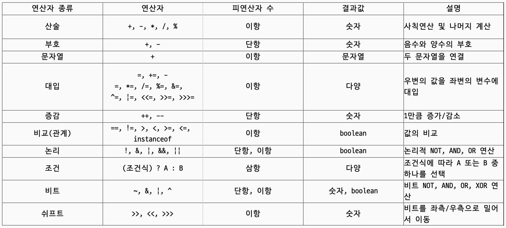
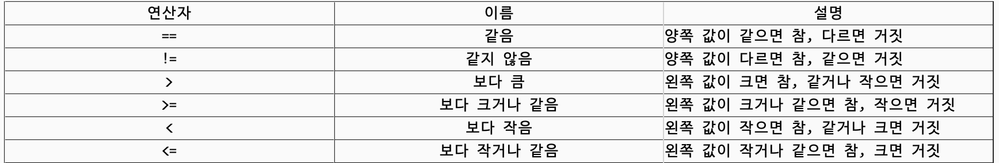
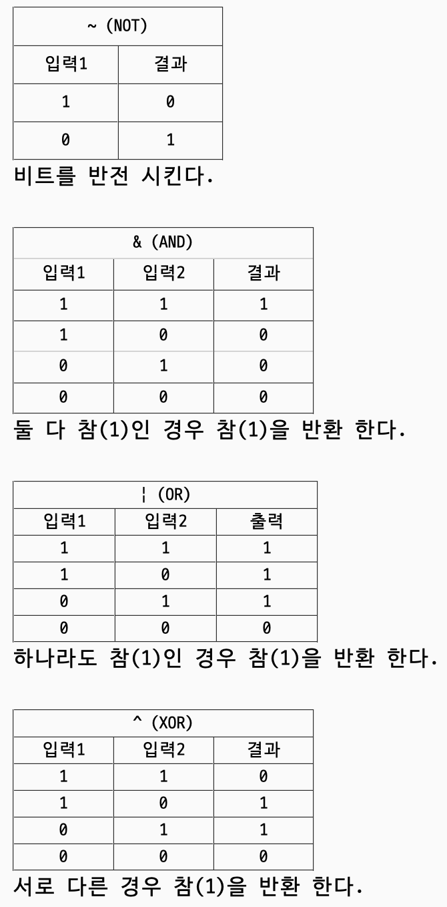
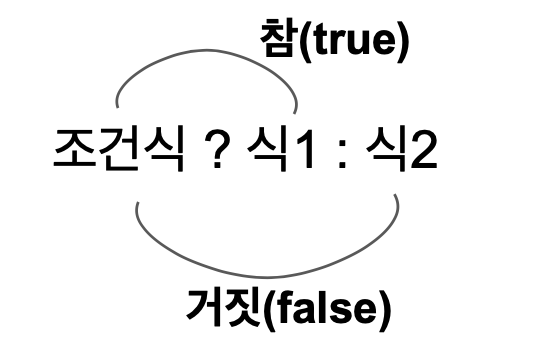
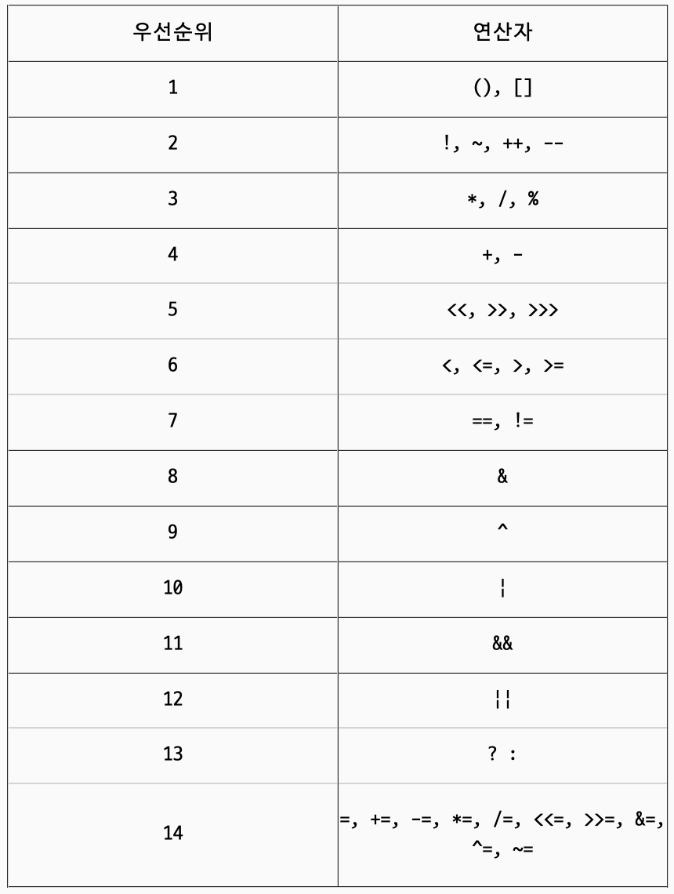

# 연산자 - 3단원

# 연산자

- 연산자(operator) 연산을 수행하는 기호 (+-/*…) → 항상 결과값을 반환함
- 피연산자(operand) 연산자의 작업 대상 (변수, 상수, 리터럴, 수식)



## 1. 단항 연산자

### 증감 연산자 ++ --

```java
int a=1;
sout(a++) -> 1 전위형
/**
이 부분을 풀어 쓰면
System.out.println(a)
a=a+1;
**/
a=1;
sout(++a); ->2 후위형
```

## 2. 산술 연산자

### 사칙 연산자

```java
(int)10 / (int)4 = 2 //소수점 이하는 버려짐
(int)10 / (float)4.0 = 2.5 -> 범위가 넓은 float에 타입 맞춰짐
(int)3 / (int)0 -> 오류
(int)3 / (float)0.0 -> infinity

//큰 자료형의 값을 작은 자료형의 변수에 넣을 경우 명시적 형변환 필요
byte a = byte 10 + byte 20 -> 연산자 '+'가 자동으로 int 변환해서 더해줌 = 컴파일 에러

//명시적 형변환 했는데 크기가 넘어가면?
byte a = byte 10 * byte 20 -> 44출력 값손실

long c = int 1백만 * int 2백만
정상적으로 값이 나올까? x 연산 순서에 따라 계산을 해보자.
오른쪽(int 1백만 * int 2백만 = -오버플로우) ->
왼쪽 long = 이상한값 => long 형변환 해줬지만 이미 int 계산으로 오버플로우 값 들어감

//char 값 연산
'2' - '0' -> 50 - 48 = 2
**순자 영문자 유니코드 -> 알고리즘 문제 풀때 자주 나옴
'0'~'9' 48 ~ 57
'A'~'Z' 65 ~ 90
'a'~'z' 97 ~ 122

//나머지 연산에 음수를 대입하면? 절대값 변환후 수행 -> 결과값 같음
10 % 8 = 2
10 % -8 = 2

```

## 3. 비교 연산자



### 문자열 비교

equals() 메소드 사용!!

## 4. 논리 연산자

- **|| (OR 연산자)** : 피연산자 중 어느 한 쪽만 true라면, true를 결과로 얻는다.
- **&& (AND 연산자)** : 피연산자 모두 true라면, true를 결과로 얻는다.

```
char ch = 'v';
if(('a' <= ch && ch <= 'z') || ('A' <= ch && ch <= 'Z')){
    System.out.println("ok");
}	// ok
```

• **! (논리 부정 연산자)** : true와 false를 반대로 바꾼다.

### 효율적인 연산

> x||y → x가 true면 항상 true                     x&&y → x가 false면 항상 false
>

('a' <= ch && ch <= 'z') || ('A' <= ch && ch <= 'Z')

소문자 또는 대문자인지 확인하는 식이다.

사용자가 대문자 보다 소문자를 입력할 확률이 높다면 이 식은 효율적으로 처리!!

## 5. 비트연산자



**<<, >> (쉬프트 연산자)**
 : 피연산자를 2진수로 표현했을 때 각 자리를 이동시키는 연산자

```
// 쉬프트 연산이 곱셈이나 나눗셈의 연산보다 더 빠르다. -> 가끔 알고리즘때 사용한다!
// x<<n은 x*2^n의 결과와 같다.
// x>>n은 x/2^n의 결과와 같다.
```

## 6. 그 외의 연산자

### 조건 연산자



### 대입 연산자 ****assignment(=) operator****

> 대입 연산자. 우변의 값을 좌변에 저장하는 연산이다.
>
- 결합방향은 오른쪽에서 왼쪽이다.

    `x=y=3`의 경우, `y=3`이 수행된 후에 `x=y`가 수행된다.

- **op= (복합 대입 연산자)** : 다른 연산자(op)와 결합하여 사용한다.

    `num += 1; // num = 9, 위의 식과 같다.`


### instanceof

> 객체가 어떤 클래스인지, 어떤 클래스를 상속받았는지 확인하는데 사용하는 연산자
>

`object instanceOf type`

대체 이걸 어디서 사용하지?

→ 보통 레퍼런스 타입 변수가 레퍼런스 데이터 타입으로 타입 변환이 가능한지 확인하기 위해서 사용

```java
class Animal {}
class Tiger extends Animal {}
class Rose {}

Animal animal = new Tiger();
if(animal instanceof Animal) // true
if(animal instanceof Tiger)	 // true
if(animal instanceof Rose)	// false
```

### ****화살표(->) 연산자****

화살표 연산자는 Java 8 버전부터 추가된 것으로, 람다 표현식과 함께 사용된다.

람다는 이후 14단원에서 이뤄어지기 때문에 자세하게 설명은 안하고 지나가겠다.

`@FunctionalInterface
public interface MyFunction{
    public int func(int a, int b);
}`

위와 같이, 함수형 인터페이스(단 한개의 추상 메소드를 가진 인터페이지) 를 만들면, 선언된 단 하나의 메서드가 람다식과 연결되어 람다식을 사용할 수 있다.

`MyFunction myFunc = (int a, int b) -> { return a + b };`

재사용은 불가하다!

## 연산자 우선 순위

