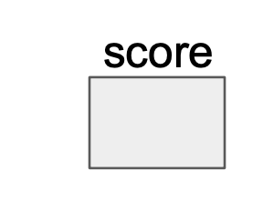
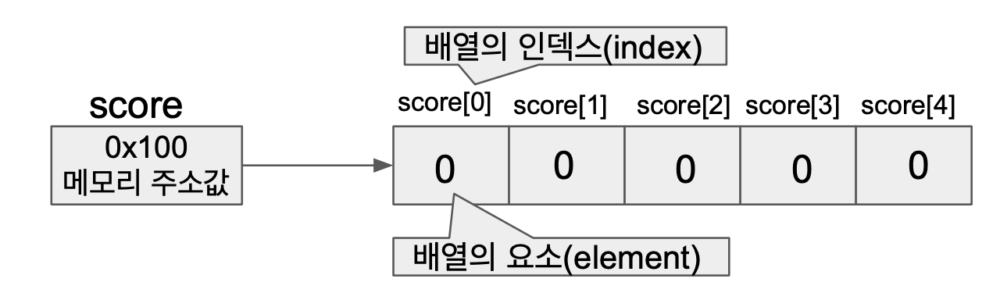
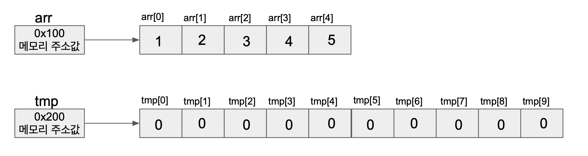
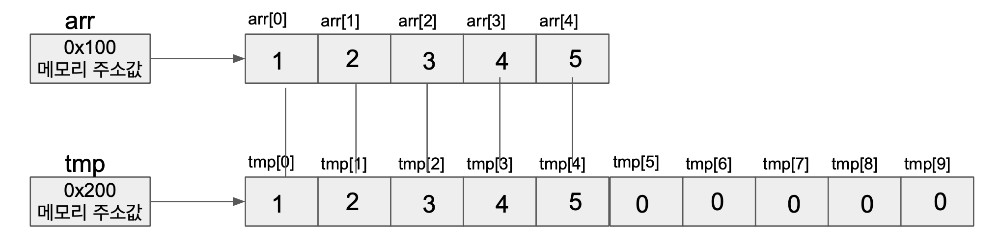
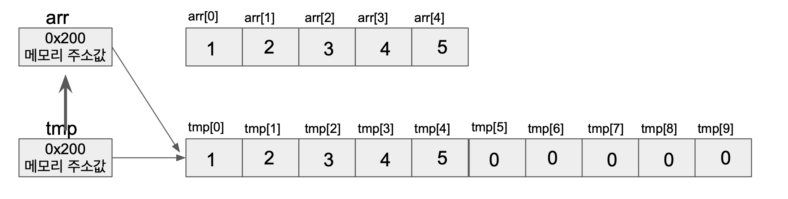
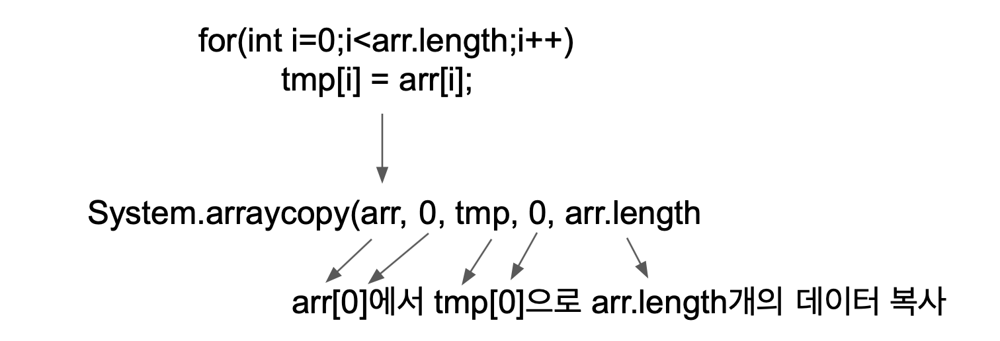
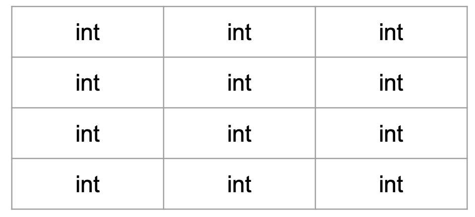
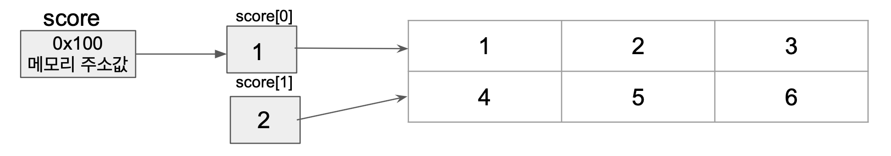

# 배열 - 5단원

# 배열

## 배열이란?

> 같은 타입의 여러 변수를 하나의 묶음으로 다루는 것
>

### 배열의 선언과 생성

```java
타입[] 변수이름; //배열 선언 ( 배열을 다루기 위한 참조변수 선언 )
변수이름 = new 타입[길이]; // 배열 생성 (실제 저장공간을 생성)

int[] score;
score = new int[5];
```

1. int[] score; - 참조변수 score 선언 - 데이터 저장 공간은 아직 x

    
2. score=new int[5];
- 연산자 new에 의해 메모리의 빈 공간 5개의 int형 데이터 저장 공간 생김

    

> 인덱스의 범위는 0부터 ‘배열길이 -1’ 까지!
>

### 배열의 길이

> int 범위의 양의 정수(0 포함) 이어야 한다!
>

score.length → 5

따라서 보통 배열을 이용한 반복문을 이용할때 범위 설정은 .length 를 사용해야 코드 관리가 쉽다

### 배열의 초기화

```java
1. int[] score = new int [5];
score[0] = 50;
score[1] = 30;
score[2] = 70;
score[3] = 80;
score[4] = 90;

2. int[] score = new int[]{50,30,70,80,90};

3. int[] score = {50,30,70,80,90};

4. add 메서드 사용
int result = add(new int[]{50,30,70,80,90});
```

### 배열의 출력

```java
int[] iArr = {100,95,80,70};

System.out.print(iArr); -> 메모리 주소값 출력 (x)

1. 반복문을 이용해 출력
for(int i=0;i<iArr.length;i++){
	System.out.print( iArr[i]+", ");
}

2. Arrays.toString() 을 이용해 출력
System.out.print(Arrays.toString(iArr));

**예외** char 배열은 그대로 출력 가능!
char[] cArr = {'a', 'b', 'c', 'd'};
System.out.print(cArr);
```

### 배열의 복사

### 1. for 문 이용

```java
int[] arr = {1,2,3,4,5};

int[] tmp = new int[arr.length*2];

for(int i=0;i<arr.length;i++)
			tmp[i] = arr[i];

arr = tmp // 참조변수 arr이 새로운 배열을 가리키게 된다.
```

1. arr.length * 2 =10 크기의 배열인 tmp 초기화

    

1. for문을 통해 하나씩 tmp 배열에 복사

    

1. 참조변수 arr에 참조변수 tmp 값 저장. 따라서 arr은 배열 tmp 가리킴 → 더 이상 arr배열은 사용 x

    

### 2. System.arraycopy()를 이용한 복사

> 배열의 복사는 for 문보다 System.arraycopy()를 사용하는 것이 효율
>
>
> 
>

# 다차원 배열

### 2차원 배열의 선언과 인덱스

- 2차원 배열 선언

```java
타입[][] 변수이름;
int[][] score;
타입 변수이름[][];
int score[][];
타임[] 변수이름[];
int[] score[];
```

- 2차원 배열 인덱스

int[][] score=new int[4][3];

4행 3열 공간이 마련됨



### 2차원 배열의 초기화

```java
int[][] arr = { {1,2,3},{4,5,6}};
```

 

 

### 가변 배열

```java
int[][] score = new int[5][];
score[0] = new int[4];
score[1] = new int[2];
score[2] = new int[6];
score[3] = new int[1];
-> 가능
```