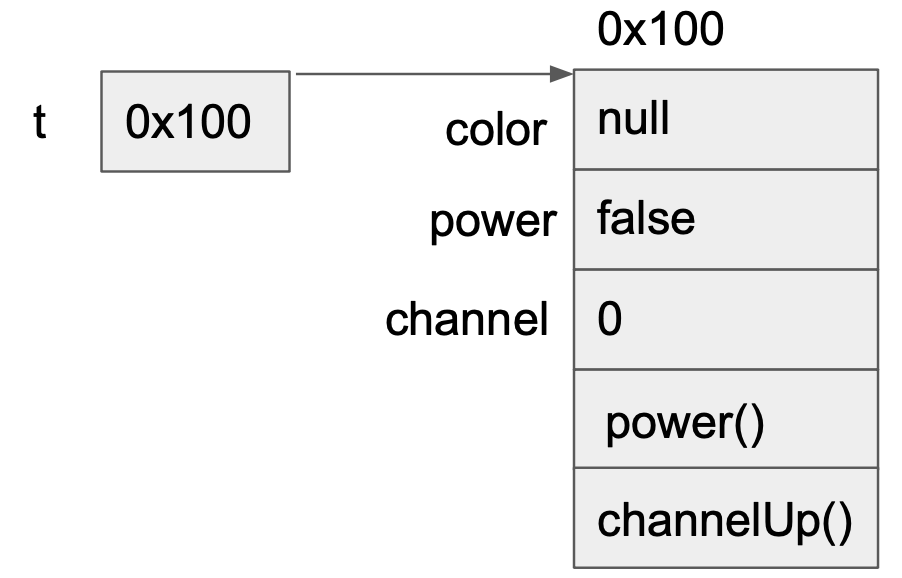
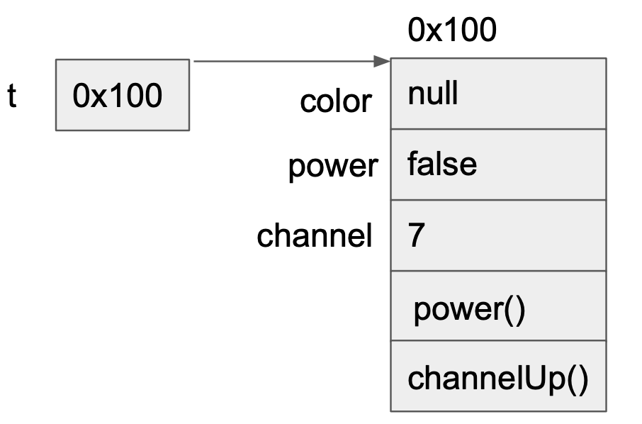
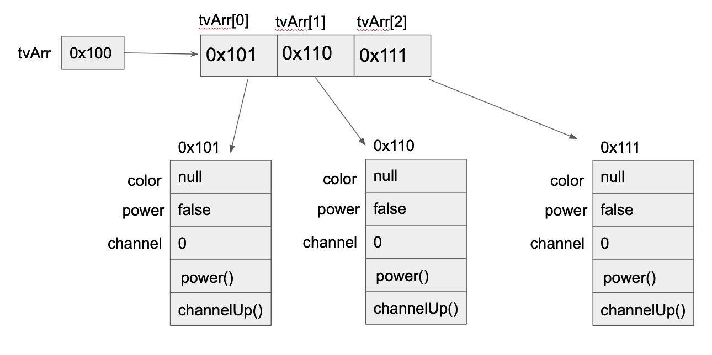
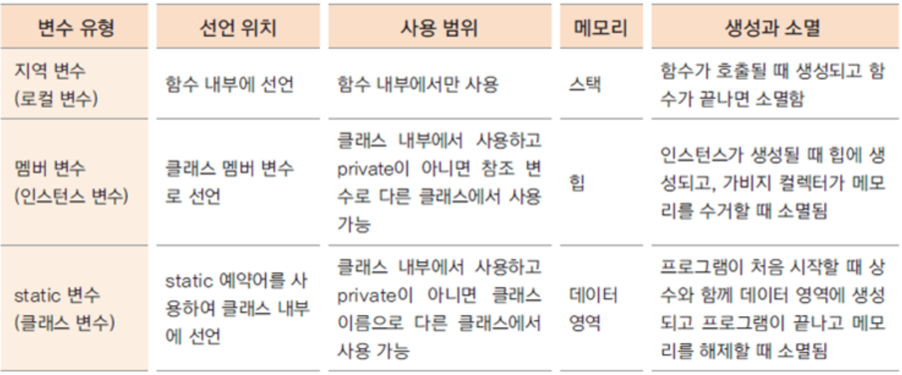
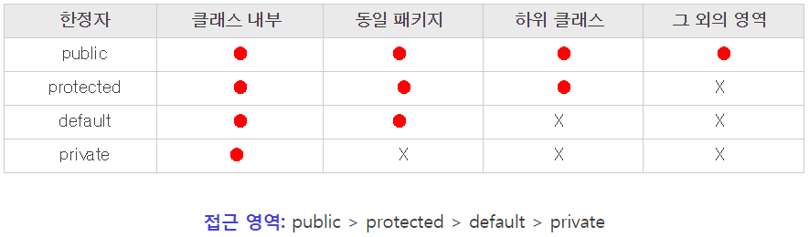
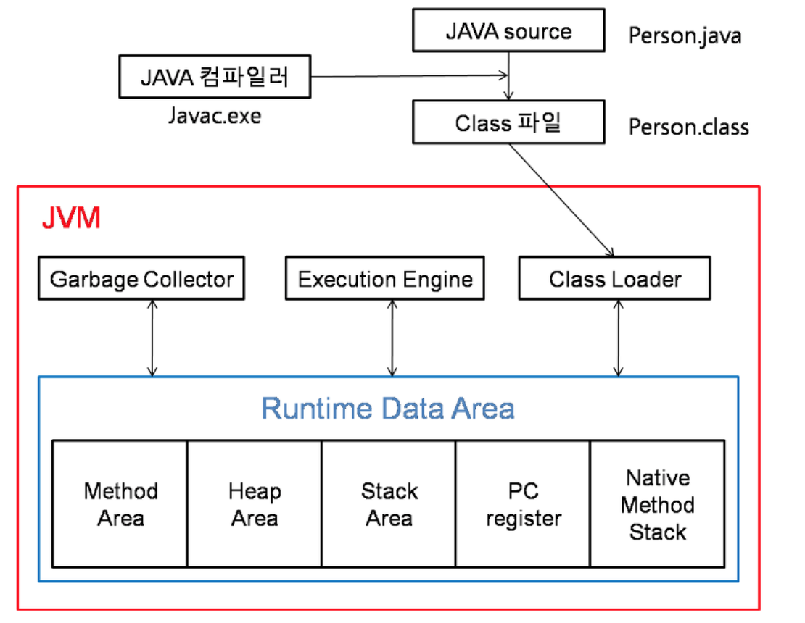
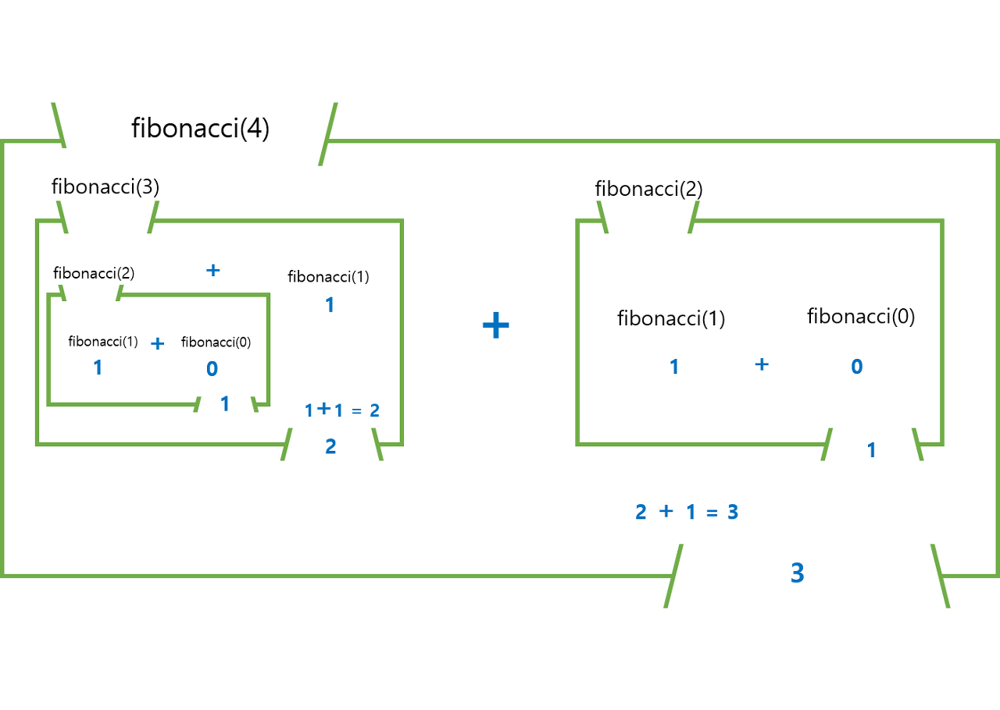

# 클래스와 객체

## 클래스와 객체의 정의와 용도

- 클래스 : 객체를 정의해 놓은 것으로 객체를 생성하는데 사용된다. → 제품 설계도
- 객체 : 실제로 존재하는 사물 또는 개념으로 객체가 가지고 있는 기능과 속성에 따라 용도가 달라진다. → 제품

## 객체와 인스턴스

인스턴스화? 클래스 → 인스턴스(객체)

인스턴스 : 어떤 클래스로부터 만들어진 객체

## 객체의 구성요소

객체는 속성과 기능의 집합이다.

속성 (property) - **멤버변수**, 특성, 필드 상태

기능(function) - **메서드**, 함수, 행위

## 인스턴스의 생성과 사용

클래스를 선언한것은 제품 설계도를 작성한 것에 불과 → 인스턴스를 생성해야 제품을 사용할 수 있다.

→ 그렇다면 인스턴스 어떻게 생성하는데?

```java
클래스명 클래스;
변수명 = new 클래스명();

Tv t; //1.
t = new TV(); //2.
t.channel = 7; //3.
t.channelUp(); //4.
```

1. Tv클래스 타입의 참조변수 t를 선언한다. 메모리에 t를 위한 공간이 마련된다. 아직 인스턴스 생성한것은 아니므로 참조변수로 아무것도 할 수 없다.


2. 연산자 new 에 의해 Tv 클래스의 인스턴스가 메모리의 빈 공간에 생성된다(동적 메모리 할당 영역 생성). 여기서는 주소 0x100에 생성되었다. 이 때, 멤버변수가 기본값으로 초기화된다.

    그 다음, 대입연산자(=)에 의해 생성된 객체의 주소값이 참조변수 t에 저장된다.



3. 참조변수 t에 저장된 주소에 있는 인스턴스의 channel에 7이 저장된다.



> 인스턴스는 참조변수를 통해서만 다룰 수 있으며,                                                              참조변수의 타입은 인스턴스의 타입과 일치해야한다.
>

<aside>
💡 여기서 new 키워드는 객체를 동적 메모리 할당 영역에 생성한다. 이 영역에 할당한다는 것은 GC에 의해 관리된다는 것을 의미한다.

</aside>

```java
Tv t1=new Tv();
Tv t2=new Tv();

t1=t2 // t2는 자신을 참조하고 있는 참조변수가 하나도 없는 인스턴스로 더 이상 사용되어질 수 없으므로
			// '가비지 컬렉터'에 의해서 자동적으로 메모리에서 제거된다.
```

## 객체배열



객체 배열은 참조변수들을 하나로 묶은 참조 변수 배열이다. ‘따라서 참조변수 배열을 생성한 후 객체를 생성해서 각 배열의 요소에 저장해야한다!

# 변수와 메서드

## 선언위치에 따른 변수의 종류

```java
class Variables{
	int iv; //인스턴스 변수
	static int cv; //클래스변수(static 변수, 공유 변수)

	void method(){
		int lv=0; //지역변수
	}
}
```



## 클래스변수와 인스턴스 변수

> 인스턴스 변수는 인스턴스가 생성될 때마다 생성되며 인스턴스 마다 각기 다른 값을 유지할 수 있지만, 클래스 변수는 모든 인스턴스가 하나의 저장 공간을 공유하므로 항상 공통된 값을 갖는다.
>

## 메서드

특정 작업을 수행하는 일련의 문장들을 하나로 묶은 것이다.

### 메서드를 사용하는 이유

1. 높은 재사용성
2. 중복된 코드의 제거
3. 프로그램의 구조화

### 메서드의 선언과 구현

```java
[접근제한자] 반환타입 메서드이름 (타입 변수명1, 타입 변수명2,..) -> 선언부
{
	//메서드 호출시 수행될 코드                   -> 구현부
	return문
}

public int add (int a, int b) -> 선언부
{
	return x+y;                -> 구현부
}
```

- 접근제한자




public 은 모든 접근을 허용하고, protected 는 같은 패키지에 속하거나 상속 관계에서 접근할 수 있도록 한다.마지막으로 private은 선언된 클래스 내에서만 접근이 가능하다.

-> 일반적으로 속성은 private 으로, 메소드는 public 으로 선언한다.

- 반환 자료형

사용자 정의 자료형을 포함하여 기본자료형, 인터페이스 등 모든 자료형 기입 가능

- 메소드 이름

변수 네이밍 컨벤션을 따름!

- 매개변수

메서드 잡업을 수행하는데 필요한 값들을 제공받는 것이다.

- return 문

메서드 반환타입이 ‘void’가 아닌경우 return 이 구현부{}안에 반드시 포함되어 있어야한다!

반환타입과 return값이 일치하거나 적어도 자동 형변환이 가능한 것 이여야한다!

## JVM의 메모리 구조



JVM은 크게 네가지 구성 요소를 가진다.

1. Class Loader

2. GC (Garbage Collector)

3. Execution Engine

4. Runtime Data Area

### 1. Class Loader

- JRE의 일부로, 바이트코드를 실행할 때 class 객체를 메모리에 생성하는 요소이다.
- 클래스의 인스턴스를 생성하면 Class Loader를 통해 메모리에 로드한다.

### 2. GC (Garbage Collector)

- 자바는 메모리 관리를 사용자가 아닌 JVM이 알아서 해준다.
- GC는 더이상 참조되지 않는 메모리를 정리해준다.
- GC가 언제 호출되는지는 알 수 없으며, 심지어 사용자가 호출하더라도 메모리 정리할 필요가 없다고 판단하면 실행하지 않는다.

### 3. Execution Engine

- 메모리에 로드 된 바이트코드를 실행하는 역할을 한다.
- Class Loader를 통해 Runtime Data Area에 배치된 바이트코드는 Execution Engine에 의해 실행 된다.
- 인터프리터 방식이나 JIT 방식으로 실행한다.

### 4. Runtime Data Area

- JVM이 프로그램 실행을 위해 OS로부터 할당받은 메모리 영역

    a. 클래스 영역

    -> 실행에 필요한 클래스들을 로드하여 저장한다. 내부에서 메소드 영역과 상수 영역으로 또 나뉘어 저장 된다.

    b. 가비지 컬렉션 힙 영역

    -> GC에 의해 관리되는 영역이다. 동적 메모리 할당 영역 이라고도 하며, 소스상에서 new 연산자로 객체를 만들 때 할당되는 영역이다.

    c. 런타임 스택 영역

    -> 프로그램 실행 중 발생하는 메소드 호출과 복귀에 대한 정보를 저장한다.

    d. 네이티브 메소드 스택 영역

    -> 자바에는 하드웨어를 직접 제어하는 기능이 없기 때문에, 필요할 경우 C언어와 같은 다른 언어의 기능을 빌려 사용한다. 이때 사용하는 기술이 JNI (Java Native Interface) 기술로 네이티브 메소드들이 바이트 코드로 변환 되면서 사용되고 기록하는 영역이다.


## 기본형 매개변수 참조형 매개변수

기본형 매개변수 - 변수의 값을 읽기만 할 수 있다.

```java
public static void main(String[] args){
	Data d=new Data();
	d.x=10;

	change(d.x);

	sout(d.x) -> 10
}

static void change(int x){
	x=1000;
	sout(d.x) -> 1000
}
```

참조형 매개변수 - 변수의 값을 읽고 변경할 수 있다. (주소값을 가진 참조변수가 전달되니깐)

```java
public static void main(String[] args){
	Data d=new Data();

	change(d);

	sout(d.x) -> 1000
}

static void change(Data d){
	d.x=1000;
	sout(d.x) -> 1000
}
```

참조형 반환타입

```java
public static void main(String[] args)
     Data3 = new Data3();
     d.x = 10;

     Data3 = copy(d);
     System.out.println("d.x = " + d.x);
     System.out.println("d2.x = " + d2.x);

     }
     static Data3 copy(Data3 d) {

     Data tmp = new Data3();

     tmp.x = d.x;

     return tmp;
    }
```

## 재귀호출

```java
public static void main(String[] args) {
    System.out.println("fibonacci : "+fibonacci(4));
}

public static int fibonacci(int N) {
    if (N == 0)	return 0;
    if (N == 1)	return 1;
    return fibonacci(N - 1) + fibonacci(N - 2);
}
```




# 오버로딩(overloading)

> 한 클래스 내에 같은 이름의 메서드를 여러 개 정의하는 것
>
1. 메서드 이름이 같아야 한다.
2. 매개변수의 개수 또는 타입이 달라야 한다.

```java
class MyClass {
		private int age;
    private String name;
    public MyClass() { }
		public MyClass(int age) {
        this.age = age;
    }
     public MyClass(String name) {
        this.name = name;
    }
     public MyClass(int age, String name) {
        this.age = age;
        this.name = name;
    }
}
```

# 생성자

> 인스턴스가 생성될 때 호출되는 ‘인스턴스 초기화 메서드'
>
1. 생성자의 이름은 클래스의 이름과 같아야 한다.
2. 생성자는 리턴 값이 없다.

`Card c = new Card();`

1. 연산자 new에 의해서 메모리(heap)에 Card클래스의 인스턴스가 생성된다.
2. 생성자 Card()가 호출되어 수행된다.
3. 연산자 new의 결과로, 생성된 Card인스턴스의 주소가 반환되어 참조변수가 c에 저장된다.

## 기본 생성자

> 기본 생성자가 컴파일러에 의해서 추가되는 경우는 클래스에                                            정의된 생성자가 하나도 없을 때 뿐이다.
>

```java
class Data1 {
  int value;
}

class Data2 {
	int value;

	Data2(int x) {
		value = x;
	}
}

class ConstructorTest {
	public static void main(String[] args) {
		Data1 d1 = new Data1();
		Data2 d2 = new Data2(); //컴파일 에러 발생
	}
}
```

## 매개변수가 있는 생성자

생성자 호출 시 값을 넘겨받아서 인스턴스의 초기화 작업에 사용

## 생성자에서 다른 생성자 호출하기 - this(), this

### this()

: 생성자, 같은 클래스의 다른 생성자를 호출할 때 사용한다.

- 생성자의 이름으로 클래스이름 대신 this를 사용한다.
- 한 생성자에서 다른 생성자를 호출할 때는 반드시 첫 줄에서만 호출이 가능하다.

### this

: 인스턴스 자신을 가리키는 참조변수, 인스턴스의 주소가 저장되어 있다. 모든 인스턴스 메서드에 지역변수로 숨겨진채로 존재한다.

# 변수의 초기화

- 변수를 선언하고 처음으로 값을 저장하는 것
- 멤버변수(클래스 변수와 인스턴스 변수)와 배열의 초기화는 선택적
- **지역변수의 초기화는 필수적!**

### 멤버변수의 초기화 방법

- 명시적 초기화(explicit initialization)

```java
int door = 4;
Engine e = new Engine();
```

- 생성자(constructor)
- 초기화 블럭(initialization block)
    - 인스턴스 초기화 블럭 : 인스턴스변수를 초기화 하는데 사용
    - 클래스 초기화 블럭 : 클래스 변수를 초기화 하는데 사용

    ```java
    static{
    	Sout("클래스 초기화")
    }
    {
    	Sout("인스턴스 초기화")
    }
    ```


### 멤버변수의 초기화 시기와 순서

**클래스 변수**

- 초기화 시점 - 클래스가 처음 로딩될 때 단 한번 초기화 된다.
- 초기화 순서 - 기본값 → 명시적 초기화 → 클래스 초기화 블럭

**인스턴스 변수**

- 초기화 시점 - 인스턴스가 생성될 때마다 각 인스턴스별로 초기화가 이루어진다.
- 초기화 순서 - 기본값 → 명시적 초기화 → 인스턴스 초기화 블럭 → 생성자


출처
 [https://velog.io/@pearl0725/JVM은-어떤-역할을-할까](https://velog.io/@pearl0725/JVM%EC%9D%80-%EC%96%B4%EB%96%A4-%EC%97%AD%ED%95%A0%EC%9D%84-%ED%95%A0%EA%B9%8C)

 [https://steady-coding.tistory.com/305](https://steady-coding.tistory.com/305)

[https://coding-factory.tistory.com/828](https://coding-factory.tistory.com/828)

[https://lts0606.tistory.com/509](https://lts0606.tistory.com/509)