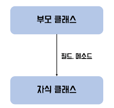
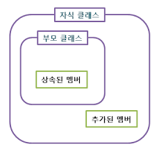
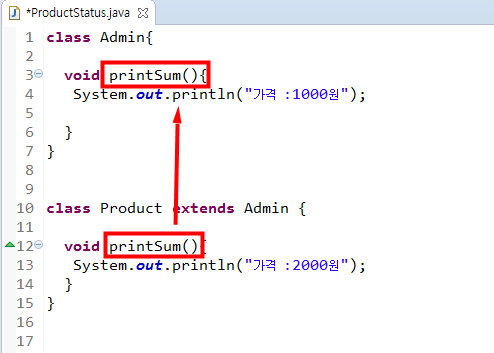
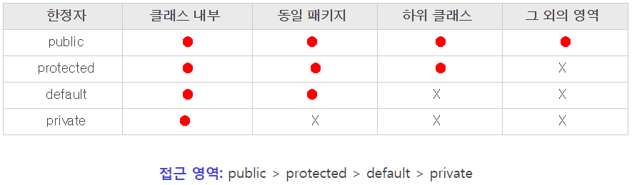

# 객체지향 프로그래밍2

# 상속(inheritance)

## 상속의 정의와 장점

> 조상 클래스 - 부모 클래스(parent), 상위(super) 클래스, 기반(base)클래스
>

> 자손 클래스 - 자식(child) 클래스, 하위(sub)클래스, 파생된(derived) 클래스
>





- 생성자와 초기화 블럭은 상속되지 않는다. 멤버만 상속된다.
- 자손 클래스의 멤버 개수는 조상 클래스보다 항상 같거나 많다.
- 자손 클래스의 인스턴스를 생성하면 조상 클래스의 멤버와 자손 클래스의 멤버가 합쳐진 하나의 인스턴스로 생성된다.
- 단일 상속만을 허용 - 클래스 간의 관계 명확 , 코드 신뢰성
    - **다중 상속**이 불가능 한 이유로, 2개의 부모 클래스의 **중복 가능성**이 있다.

    만약, 2개의 부모 클래스에 동일한 이름의 필드나 메소드가 있으면?

    - 어떤 부모 클래스의 필드 or 메소드를 상속받아야 하는가?
    - 어떤 부모 클래스에 어떻게 접근해야 하는가?

    와 같은 문제가 발생할 수 있다.

- 모든 클래스는 Object 클래스를 상속받는다.
- 부모 클래스 내에서 멤버 변수 또는 메소드가 private 접근 제한자 를 사용하면

    **멤버변수는 상속받으나 → 바로 접근이 불가능하다.**

    **메소드는 상속되지 않는다.**

- static 메서드 또는 변수도 상속이 된다.

## 클래스간의 관계

```java
class Point{
	int x;
	int y;
}

class Shape{
	String color = "black";
	void draw(){
			sout();
	}
}

class Circle extends Shape{
	Point p=new Point();
	//int x;
	//int y;
	int r;
}
```

### 상속관계

‘~은 ~이다 (is - a)’

**A Circle is a Shape //1. 원은 도형이다. → 0**

A Circle is a Point //2. 원은 점이다 → x

### 포함관계

‘~은 ~을 가지고 있다.(has - a)’

A Circle has a Shape //3. 원은 도형을 가지고 있다 → x

**A Circle has a Point //4. 원은 점을 가지고 있다. → 0**

## 오버라이딩

> 부모클래스로 부터 상속받은 메소드를 자식클래스에서 재정의하여 사용하는 것.
>



[https://ontheinfo.com/2336](https://ontheinfo.com/2336)

### 오버라이딩의 조건

- 자손 클래스에서 오버라이팅하는 메서드는 조상 클래스의 메서드와
    - 이름이 같아야 한다.
    - 매개변수가 같아야 한다.
    - 반환타입이 같아야 한다.
- 조상 클래스의 메서드를 자손 클래스에서 오버라이딩할 떼
    - 접근 제어자를 조상 클래스의 메서드보다 좁은 범위로 변경할 수 없다.
    - 예외는 조상 클래스의 메서드보다 많이 선언할 수 없다.
    - 인스턴스메서드를 static메서드로 또는 그 반대로 변경할 수 없다.


### 오버로딩 vs 오버라이딩

이름이 비슷해서 많이들 헷갈려한다.(특히 나)

> 오버로딩 기존에 없는 새로운 메서드를 정의하는 것(new)
>

> 오버라이딩 상속받은 메서드의 내용을 변경하는 것 (change, modify);
>

```java
class Parent{
	void parentmethod(){}
}

class Child extends Parent{
	@Override
	void parentmethod(){ sout("child");} //오버라이딩
	void parentmothod(int i){} //오버로딩
```

<aside>
💡 **오버라이딩 시 @Override 애노테이션을 명시적으로 표현하도록 한다.**

</aside>

## super

> super는 자손 클래스에서 조상 클래스로부터 상속받은 멤버를 참조하는데 사용되는 참조변수이다.
>

인스턴스 변수의 이름과 지역 변수의 이름이 같은 경우, 인스턴스 변수 앞에 this 키워드로 구분할 수 있었다.

이와 마찬가지로 부모 클래스의 멤버와 자식 클래스의 멤버 이름이 같은 경우 super 키워드를 사용하여 구분할 수 있다.

이렇게 자바에서는 super 참조 변수를 사용하여 부모 클래스의 멤버에 접근할 수 있다.

**사용방법**

1. 부모 클래스의 멤버 변수 접근 : **super**.멤버변수
2. 부모 클래스의 멤버 메소드 접근 : **super**.멤버메소드(매개변수);
3. 부모 클래스의 생성자 호출 : **super**(매개변수);

**주의점**

1. 반드시 자식 클래스의 생성자 첫 라인에서 부모 생성자를 호출해야 한다.
2. 자식 클래스의 생성자 내에서 반드시 부모 생성자를 호출해야 한다.
3. 명시적으로 자식 클래스에서 부모 생성자를 호출하지 않아도 super 키워드를 이용한 생성자 호출이 자동 삽입되어 부모 클래스의 생성자를 호출하게 된다.

    → 만약 별도 매개변수를 가진 생성자를 자식 클래스에서 생성했다면? 부모 클래스의 생성자를 호출하는 super(); 를 직접 입력해야 한다.


### super()

> this() 가 같은 클래스의 다른 생서자를 호출할 때 사용된다면, super() 는 부모 클래스의 생성자를 호출할 때 사용된다.
>

자손 클래스를 인스턴스 생성할때 조상 클래스의 생성자도 호출되어야함 → 따라서 super() 생략되어있음

- Obeject클래스를 제외한 모든 클래스의 생성자 첫 줄에 생성자this() 또는 super()를 호출해야 한다. 그렇지 않으면 컴파일러가 자동적으로 ‘super();’를 생성자의 첫줄에 삽입한다.

[https://www.notion.so/e5c33507880b4d098f83a2c4f8f02c04](https://www.notion.so/e5c33507880b4d098f83a2c4f8f02c04)

# 제어자(modifier)

> 변수 또는 메서드의 선언부에서 함께 사용되어 부가적인 의미를 부여
>

### static - 클래스의, 공통적인

> ‘클래스의' 또는 ‘공통적인'의 의미를 가짐
>
- 클래스변수(static 멤버변수)는 인스턴스에 관계없이 같은 값을 가짐 → 모든 인스턴스가 공유
1. 멤버변수
- 모든 인스턴스에 공통적으로 사용되는 클래스 변수가 된다.
- 클래스 변수는 인스턴스를 생성하지 않고도 사용 가능
- 클래스가 메모리에 로드될 때 생성된다.
1. 메서드
- 인스턴스를 생성하지 않고도 호출이 가능한 static 메서드가 된다.
- static 메서드 내에서는 인스턴스 멤버들을 직접 사용할 수 없다.

### final - 마지막의, 변경될 수 없는

> ‘마지막의' 또는 ‘변경될 수 없는’의미를 가짐
>
1. 클래스
- 변경될 수 없는 클래스, 확장될 수 없는 클래스가 된다.
- 그래서 final로 지정된 클래스는 다른 클래스의 조상이 될 수 없다.
1. 메서드
- 변경될 수 없는 메서드, final로 지정된 메서드는 오버라이딩을 통해 재정의 될 수 없다.
1. 멤버변수, 지역변수
- 변수 앞에 final이 붙으면, 값을 변경할 수 없는 상수가 된다.
    - 변수 이름의 모든 문자는 **대문자**여야 한다.
    - 변수 이름에 **_(언더바)**를 선택적으로 이용할 수 있다.


### abstract - 추상의, 미완성의

> ‘미완성’의 의미를 가진다.
>
1. 클래스
- 클래스 내에 추상 메서드가 선언되어 있음을 의미한다.
1. 메서드
- 선언부만 작성하고 구현부는 작성하지 않은 추상 메서드임을 알린다.

### 접근제어자



- private 같은 클래스 내에서만 접근이 가능하다.
- default 같은 패키지 내에서만 접근이 가능하다.
- protected 같은 패키지 내에서, 그리고 다른 패키지의 자손 클래에서 접근이 가능하다.
- public 접근 제한이 전혀 없다.

-> 일반적으로 속성은 private 으로, 메소드는 public 으로 선언한다.

- 접근제어자 사용하는 이유
    - 외부로부터 데이터를 보호하기 위해서
    - 외부에는 불필요한, 내부적으로만 사용되는 부분을 감추기 위해서


### 제어자의 조합

1. **메서드에서 static과 abstract를 함께 사용할 수 없다.** → static메서드는 몸통이 있는 메서드에만 사용할 수 있기 때문이다.
2. **클래스에 abstract와 final을 동시에 사용할 수 없다.** → 클래스에 사용되는 final은 클래스를 확장할 수 없다는 의미이고 abstrat는 상속 통해서 완성되어야 한다는 의미이므로 서로 모순되기 때문이다.
3. **abstrat메서드의 접근 제어가자 private 일 수 없다.** → abstract메서드는 자손 클래스에서 구현해주어야 하는데 접근 제어자가 private이면, 자손 클래스에서 접근할 수 없기 때문이다.
4. **메서드에 private과 final을 같이 사용할 필요는 없다.** → 접근 제어자가 private인 메서드는 오버라이팅될 수 없기 때문이다. 이 둘 중 하나만 사용해도 의미가 충분하다.

# 다형성(polymorphism)

> 여러 가지 형태를 가질 수 있는 능력
>

자바에서는 조상 클래스 타입의 참조변수로 자손클래스의 인스턴스를 참조할 수 있도록 하였다!

다형성을 활용하면부모 클래스가 자식 클래스의 동작 방식을 알수 없어도 오버라이딩을 통해 자식 클래스를 접근할 수 있습니다.

그렇다면 어떻게  부모가 자식이 어떤 일을 하는 지 몰라도,  자식 멤버 함수를 호출시킬 수 있을 까요?

이유는동적 바인딩 때문입니다.동적바인딩이란, 메서드가 실행 시점에서 성격이 결정되는 바인딩인데요.

프로그램의 컴파일 시점에 부모 클래스는 자신의 멤버 함수밖에 접근할 수 없으나, 실행 시점에 동적 바인딩이 일어나 부모클래스가 자식 클래스의 멤버함수를 접근하여 실행할 수 있습니다.

- 조상 타입의 참조변수로 자손타입의 인스턴스를 참조할 수 있다.
- 반대로 자손타입의 참조변수로 조상타입의 인스턴스를 참조할 수는 없다.
- 자손 타입 → 조상타입(Up-casting) : 형변환 생략가능 —> 조상타입의 인스턴스 멤버가 자손타입이 다 가지고있으니깐
- 자손 타입 ← 조상타입(Down-casting) : 형변환 생략불가 —> 자손타입은 조상타입의 확장 따라서 인스턴스 멤버가 같거나 많다. → 자손타입의 인스턴스 멤버는 호출 불가
- 참조변수가 가리키는 인스턴스의 자손타입으로 형변환은 허용되지 않는다. 그래서 참조변수가 가리키는 인스턴스의 타입이 무엇인지 확인하는 것이 중요하다.

```java
Car car=new Car();
FireEngine fe=null;

fe=(FireEngine) car; -> 실행 시 에러
Car 인스턴스 new로 생성했음 따라서 인스턴스를 자손타입의 참조변수로 참조하는것은 허용 x
```

### instanceof

> 객체가 어떤 클래스인지, 어떤 클래스를 상속받았는지 확인하는데 사용하는 연산자
>

`object instanceOf type`

대체 이걸 어디서 사용하지?

→ 보통 레퍼런스 타입 변수가 레퍼런스 데이터 타입으로 타입 변환이 가능한지 확인하기 위해서 사용

```java
class Animal {}
class Tiger extends Animal {}
class Rose {}

Animal animal = new Tiger();
if(animal instanceof Animal) // true
if(animal instanceof Tiger)	 // true
if(animal instanceof Rose)	// false
```

### 참조변수와 인스턴스의 연결

메서드인 method()의 경우 참조변수의 타입에 관계없이 항상 실제 인스턴스의 타입인 Child클래스에 정의된 메서드가 호출 but 인스턴스 변수인 x는 참조변수의 타입에 따라 달라진다.

```java
class Parent{
	int x=100;
	void method(){
		sout("Preant");
	}
}
class Child extends Parent{
	int x=200;
	void method(){
		sout("Child");
	}
}
class Test{
	public static void main(String[] srgs){
		Parent p=new Parent();
		Child c=new Child();

		sout(p.x); -> 100
		p.method(); -> Child

		sout(c.x); -> 200
		c.method(); -> Child
		}
}
```

### 매개변수의 다형성

상속받고 조상 클래스를 매개변수로 쓰면 자손 클래스도 매개변수를 사용할 수 있다 → 다형성

### 여러 종류의 객체를 배열로 다루기

조상클래스 타입의 참조배열 선언하면 그 배열에 자손 객체들을 저장 가능

# 추상 클래스

> 실질적으로 동작하는 클래스에서 가져야 할 필드와 메소드를 정의해놓은 클래스
>
- 정의하는 구현부 body 부분을 가질 수 없다.
- **추상 클래스의 추상 메소드는 상속 받는 클래스에서 재정의 해야한다!**

```java
public abstract class Animal {   // 정말 단순한 추상 클래스
    public abstract void bark();   //  추상 메소드
}

class Dog extends Animal{  // 추상 클래스를 상속받음

    @Override
    public void bark() {   // 추상 클래스 오버라이딩
        System.out.println("wak! wak!");
    }
}

class Cat extends Animal {   // 추상 클래스를 상속받음

    @Override
    public void bark() {   // 추상 클래스 오버라이딩
        System.out.println("meow! meow!");
    }
}
```

근데 이걸 왜 써?

자손 클래스에서 추상 메서드를 반드시 구현하도록 강요하기 위해서!
