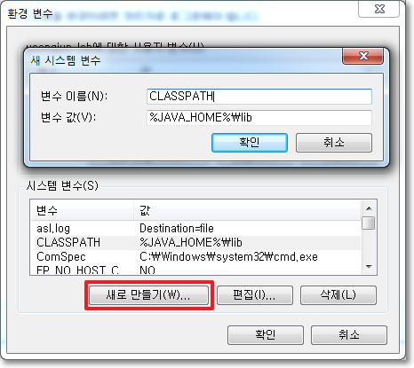

# 패키지

## 학습할 것

- package 키워드
- import 키워드
- 접근제어자
- 클래스패스
- CLASSPATH 환경변수
- classpath 옵션

---

## pakage 키워드

> 패키지란? 클래스의 묶음
>

`pakage c.javapakage`

- 클래스의 실제 이름은 패키지명을 포함한 것 → 클래스를 구분짓는 폴더 개념
- 자바는 패키지의 가장 상위 디렉토리(root) 에서 실행해야한다는 약속이 있기 때문에 해당 패키지로 가서 컴파일 하지 않는다.
- 소스에 가장 첫 줄에 있어야하고, 패키지 선언은 소스 하나에 하나만 있어야한다.
- 패키지 이름과 위치한 폴더의 이름이 같아야한다.
- 패키지이름을 java 로 시작하면 안된다.
- 모든 클래스에는 정의된 클래스 이름과 패키지 이름이 있다. 이 둘을 합쳐야 완전하게 한 클래스를 표현한다고 할 수 있으며 **FQCN(Fully Qualified Class Name)** 이라고 한다.

예를 들어 String 클래스의 패키지는 java.lang이며 FQCN은 java.lang.String이 된다.

### **패키지 이름 명명 규칙**

- 패키지 이름은 모두 소문자여야한다.
- 자바의 예약어를 사용하면 안된다. (예, `int`, `static`)
- 상위 패키지와 하위 패키지는 . 을 사용해서 연결
- java 로 시작하면 자바에서 기본적으로 제공하는 패키지
- javax 로 시작하면 자바에서 기본적으로 제공하는 확장 패키지
- org 로 시작하면 비영리 단체에서 만든 패키지
- com 으로 시작하면 기업에서 만든 패키지

### **빌트-인 패키지(Built-in Package)**

자바에서 java.lang 패키지는 아주 기본적인 것들이기 때문에 import로 불러오지 않아도 자바가 알아서 java.lang의 클래스를 불러온다. 예) String, System

```java
import java.lang.String;
import java.lang.System;

public class Main{
	public static void main(String[] args){
		String str = this is from java.lang.String";
		System.out.println(str);
	}
}
```

<aside>
💡 모든 클래스는 반드시 하나의 패키지에 포함되어야 한다! → 엇 나는 패키지 선언 안한적 있는데? → 기본적으로 제공하는 ‘이름없는 패키지(unnamed pakage)’ 때문이다.

</aside>

## **import 키워드**

`import 패키지명.클래스명`

다른 패키지에 있는 클래스를 찾을때 사용한다.

```java

//import 로 클래스를 선언하지 않으면 -> zmffotm dlfmadp vozlwlaud wjrdjwnjdigka
java.util.Date today = new java.util.Date();

//import 이용하면
import java.util.Date;

Date today = new Date();
```

### static import문

클래스 이름을 생략할 수 있다!

```java
System.out.println();

->
import static java.lang.System.out;

out.println();
```

## ****-classpath 옵션****

> 클래스패스란? 말그대로 클래스를 찾기 위한 경로
>

JVM이 프로그램을 실행할 때, .class파일을 찾는 데 기준이 되는 파일 경로이다.

java runtime(java 또는 jre)으로 이 .class 파일에 포함된 명령을 실행하려면, 이 파일을 찾을 수 있어야 한다. .class 파일을 찾을 때, classpath에 지정된 경로를 사용한다.

classpath는 .class 파일이 포함된 디렉토리와 파일을 콜론(;)으로 구분한 목록이다.

이 classpath 를 지정하기 위한 방법이다.

### CLASSPATH 환경변수 사용

윈도우즈에서 다들 한 번씩 환경변수 설정을 해보신 경험이 있을거다.

`CLASSPATH=.;C:\Program Files\Java\jdk-10.0.1\lib\tools.jar`

컴퓨터 시스템 변수 설정을 통해 지정할 수 있다.JVM이 시작될 때 JVM의 클래스 로더는 이 환경 변수를 호출한다. 그래서 환경 변수에 설정되어 있는 디렉토리가 호출되면 그 디렉토리에 있는 클래스들을 먼저 JVM에 로드한다. 그러므로 CLASSPATH 환경 변수에는 클래스들이 위치한 디렉토리를 등록하도록 한다.

컴퓨터 시스템 변수 설정을 통해 지정할 수 있다.



### **java runtime 에 -classpath 옵션 사용**

`javac <options> <souce files>`

컴파일러가 컴파일 하기 위해서 필요로 하는 참조할 클래스 파일들을 찾기 위해서 컴파일시 파일 경로를 지정해주는옵션

`Hello.java`파일이 `C:\Java` 디렉터리에 존재하고,

필요한 클래스 파일들이 `C:\Java\Engclasses`에 위치한다면,

`javac -classpath C:\Java\Engclasses C:\Java\Hello.java` 로 해주면 된다.

만약 참조할 클래스 파일들이

`C:\Java\Engclasses`,`C;\Java\Korclasse`, 그리고 현 디렉토리에도 존재한다면,

`javac -classpath .;C:\Java\Engclasses;C;\Java\Korclasses C:\Java\Hello.java`

.(현재 디렉터리); `C:\Java\Engclasses`(디렉터리);`C;\Java\Korclasse`(디렉터리);

-classpath → -cp 줄임말 가능

<출처>
https://effectivesquid.tistory.com/entry/
https://kils-log-of-develop.tistory.com/430
https://xxxelppa.tistory.com/200?category=858435