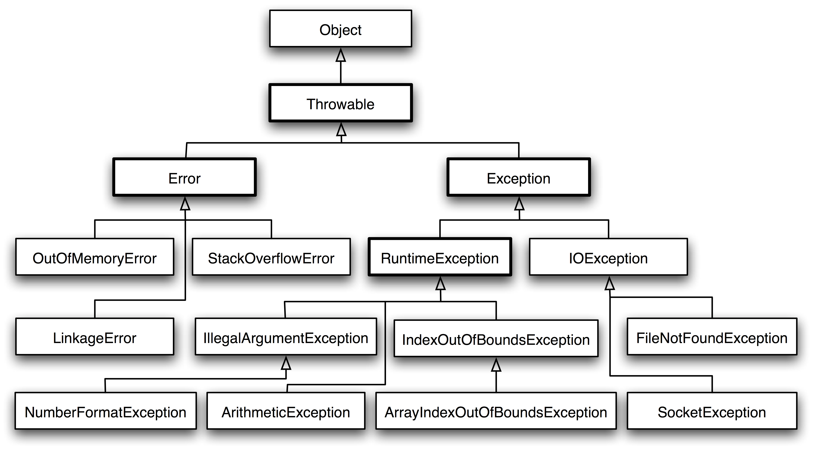
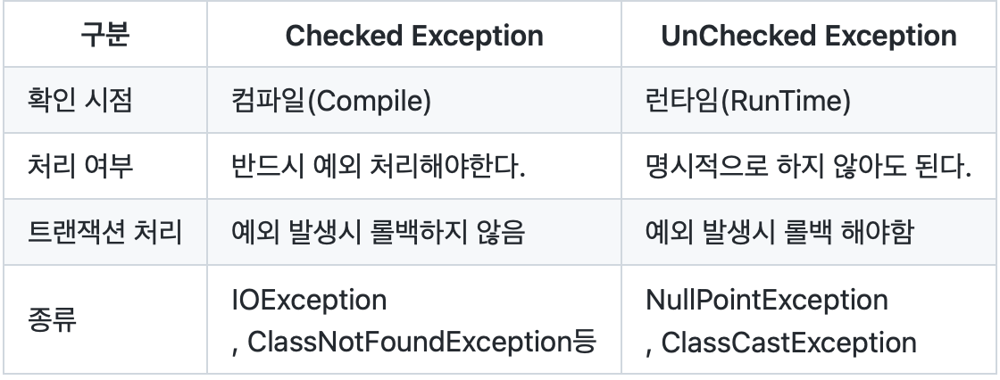
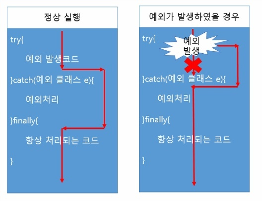

# 예외 처리

## 프로그램 오류

> 프로그램이 실행 중 어떤 원인에 의해서 오작동을 하거나 비정상적으로 종료되는 경우 → 초대하는 원인을 프로그램 에러 또는 오류라고 한다.
>
- 컴파일 에러 : 컴파일 시에 발생하는 에러
- 런타임 에러 : 실행 시에 발생하는 에러
- 논리적 에러 : 실행은 되지만, 의도와 다르게 동작하는 것

컴파일러가 .java소스코드에 대해 오타나 잘못된 구문, 자료형 체크 등의 기본적인 검사를 수행하여 오류가 있는지 체크한다 → 없으면 .class파일을 실행하는데 실행 도중 발생할 수 있는 오류로는 ‘에러'와 ‘예외'가 있다.

- 에러 : 프로그램 코드에 의해서 수습될 수 없는 심각한 오류 → 복구할 수 없는 심각한 오류
- 예외 : 프로그램 코드에 의해서 수습될 수 있는 다소 미약한 오류 → 개발자가 적절한 코드 미리 작성하면 막을 수 있음

## 예외 클래스의 계층구조



Error와 Exception역시 Object클래스의 자손들이다.

모든 예외의 최고 조상은 Exception클래스이며 여기서 RuntimeException클래스들과 제외한 나머지 Exception 클래스들로 성질이 나뉜다.

- Exception 클래스들 : 사용자의 실수와 같은 외적인 요인에 의해 발생하는 예외
- RuntimeException클래스들 : 프로그래머의 실수로 발생하는 예외
- **Checked Exception과 Unchecked Exception 차이점**
- RuntimeException을 상속하지 않은 클래스는 Checked Exception, 반대로 상속한 클래스는 Unchecked Exception으로 분류할 수 있다.

### Unchecked Exception
Unchecked Exception(RuntimeException클래스와 그 자손들)은 주로 프로그래머의 실수에 의해서 발생될 수 있는 예외들로 자바의 프로그래밍 요소들과 관계가 깊다.

예를 들어
- 배열의 범위를 벗어난다던가(ArrayIndexOutOfBoundsException)
- 값이 null인 참조변수의 멤버를 호출하려 했다던가(NullPointerException)
- 클래스 간의 형변환을 잘못했다던가(ClassCastException)
- 정수를 0으로 나누려고(ArithmeticException)
하는 경우에 발생한다.

명시적인 처리를 강제하지 않고, 실행되는 시점(Runtime)에 확인한다.

### Checked Exception
Checked Exception(RE클래스들을 제외한 나머지 클래스들)은 주로 외부의 영향으로 발생하는 것들로, 프로그램 사용자들의 동작에 의해서 발생하는 경우가 많다.

예를 들어

- 존재하지 않는 파일의 이름을 입력했다던가(FileNotFoundException)
- 실수로 클래스의 이름을 잘못 적었다던가(ClassNotFoundException)
- 입력한 데이터 형식이 잘못된(DataFormatException)
경우에 발생한다.

이름에서 알 수 있듯이 반드시 예외를 처리해야하고, 컴파일되는 시점에 확인한다.




여기서 에러처리할 수 있는 방법은

1. 예외 복구 try-catch문
2. 예외 처리 회피 throws
3. 예외 전환 throw new CustomException ("CustomException 발생");

## 예외 처리하기 - try-catch문

> 예외처리(exception handling)의
정의 - 프로그램 실행 시 발생할 수 있는 예외에 대비한 코드를 작성하는 것
목적 - 프로그램의 비정상 종료를 막고, 정상적인 실행상태를 유지하는 것
>

만약 예외 처리 못하면? JVM의 예외처리기(UncaugthExceptionHandler)가 받아서 예외의 원인을 출력

### **try/catch문 문법**

```java
try {
  // 예외발생할 가능성이 있는 문장

}catch(Exception1 e1) {
  // Exception1이 발생했을 경우, 이를 처리하지 위한 문장적는다.

}catch(Exception2 e2) {
  // Exception2이 발생했을 경우, 이를 처리하지 위한 문장적는다.

}catch(ExceptionN eN) {
  // ExceptionN이 발생했을 경우, 이를 처리하지 위한 문장적는다.

}
```

- try 블럭 내에서 예외가 발생한 경우.
1. 발생한 예외와 일치하는 catch블럭이 있는지 확인한다.
2. 일치하는 catch 블럭을 찾게 되면, 그 catch 블럭 내의 문장들을 수행하고 전체 try-catch문을 빠져나가서 그 다음 문장을 계속해서 수행한다. 만일 일치하는 catch 블럭을 찾지 못하면, 예외는 처리되지 못한다.
- try 블럭 내에서 예외가 발생하지 않는 경우
1. catch블럭을 거치지 않고 전체 try-catch문을 빠져나가서 수행을 계속한다.



<aside>
💡 아미작 catch문에 Exception클래스 타입의 참조변수를 선언하면, 어떤 종류의 예외가 발생하더라도 이 catch블럭에 의해 처리되도록 할 수 있다!

</aside>

### printStackTrace()와 getMassage()

예외 발생했을때 생성되는 예외 클래스 인스턴스에 발생한 예외의 대한 정보가 담겨있고 printStackTrace()와 getMassage()을 통해 정보를 얻을 수 있다.

> printStackTrace() - 예외발생 당시의 호출스택(Call Stack)에 있었던 메서드의 정보와 예외 메시지를 화면에 출력한다.
getMassage() - 발생한 예외클래스의 인스턴스에 저장된 메시지를 얻을 수 있다.
>

에러 처리로 비정상 종료를 막으면서 예외 발생원인까지 알 수 있음

```java
try{
}catch(Exception e){
	e.printStackTrace(); -> 예외정보 나옴
}
```

### 멀티 catch 블럭

중복 코드 줄이기~

```java
catch(ExceptionA | ExceptionB e){
	e.printStackTrace();
	e.methodA(); -> 에러
	if(e instanceof ExceptionA){
		ExceptionA e1=(ExceptionA)e;
		e.methodA(); -> 이렇게 해야함
	}
}
```

## 예외 전환 throw

```java
먼저, 연산자 new를 이용해 발생시키려는 예외 클래스의 객체를 만든 다음
Exception e = new Exception("고의로 발생시키는 오류");

키워드 throw를 이용해서 예외를 발생시킨다.
throw e;
```

## 예외 처리 회피 throws

메서드 선언부에 키워드 throws를 사용해서 메서드 내에서 발생할 수 있는 예외를 적어주기만 하면 된다.

```java
void method() throws Exception,... {
       // 메서드 내용
     }
```

## finally 블럭

```java
try{
//예외 발생할 가능성이 있는 문장
}catch(Exception e){
//예외처리를 위한 문장

}finally{
//예외 발생여부에 관계없이 항상 수행되어야하는 문장
//예외 발생 try -> catch -> finally
//예외 발생x try -> finally
}
```

## ****자동 자원 반환 try-with-resources문****

입출력에 사용되는 클래스 중에서는 사용한 후에 꼭 닫아줘야하는 File, DB등이 있다.

```java
//사용 전에 코드 복잡
try {
          fis = new FileInputStream("scroe.dat");
        dis = new DataInputStream(fis);
    } catch(IOException e) {
        e.printStackTrace();
    } finally {
			try{
	      dis.close();
			}catch(IOException ie){
				ie.printStackTrace();
			}
    }
  }

try(
      fis = new FileInputStream("score.dat");
      dis = new DataInputStream(fis)
//try블럭 안에 객체는 따로 close() 호출하지 x 자동적으로 호출
    ) {
      while (true) {
        score = dis.readInt();
        system.out.println(score);

        sum += score;
      }
    } catch(lOException e) {
        e.printStackTrace();
    }
  }
```

## 사용자 정의 예외

> 일반 예외로 선언할 경우 Exception을 상속받아 구현
실행 예외로 선언할 경우 RuntimeException을 상속받아 구현
>

### **연결된 예외(chained exception)**

> 예외가 다른 예외를 발생 시킬 수 있는 데 예를 들어 예외 A가 예외 B를 발생시켰다면A를 B의 '원인 예외(Cause Exception)라고 한다.
>

```java
public static void method1() throws Exception {
	try {
  	System.out.println("method1()에서 호출")
  } catch(Exception e) {
  	customException ce = new customException();
  	ce.initCause(e);
  	throw ce;
  }
}
// 먼저 customException를 생성한 후에, intiCause()로 Exception를 customException의
// 원인 예외로 등록한 뒤 'throw'로 이 예외를 던진다.
```

출처
자바의 정석
https://github.com/itsChrisJang/study-java-standard/blob/main/Chapter08/add%20Chapter%208예외처리(Exception%20Handling).md