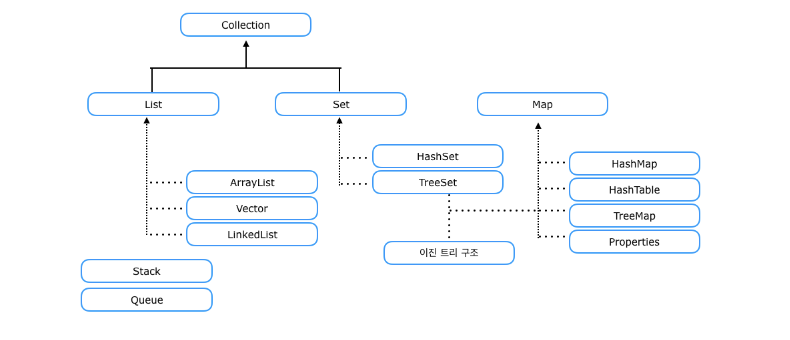
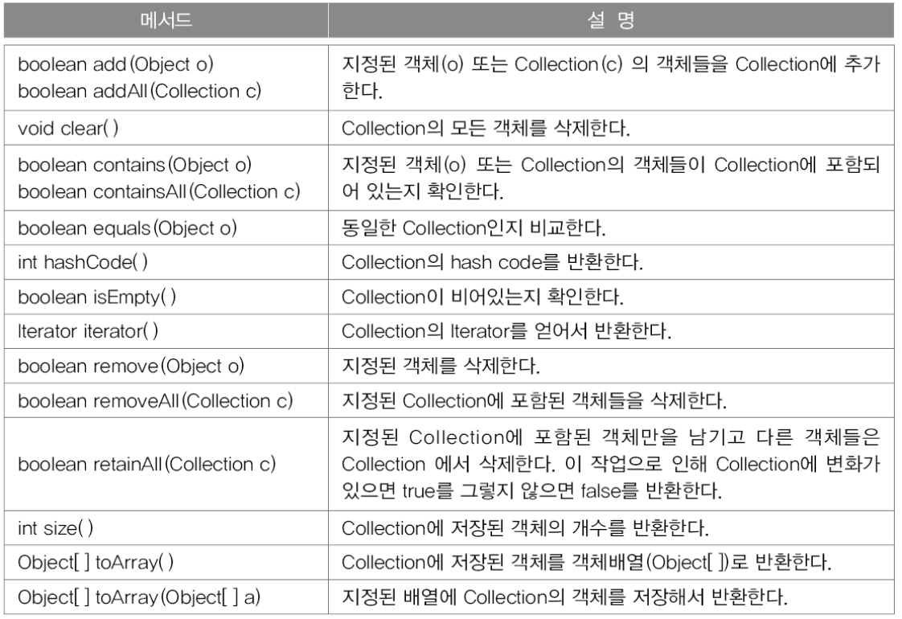
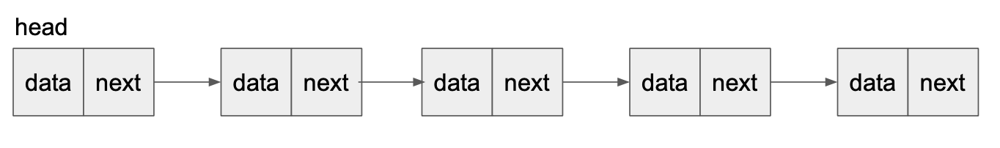
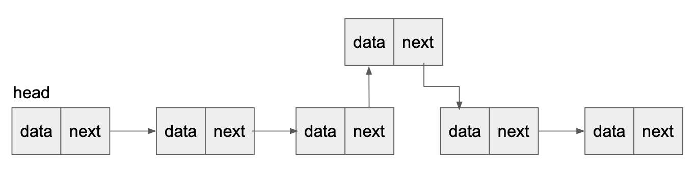
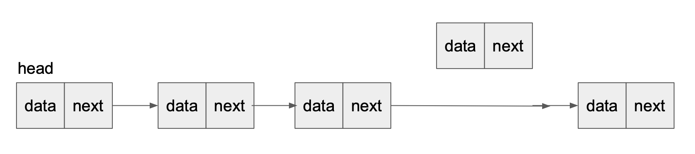
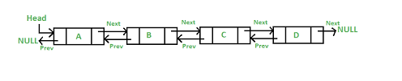
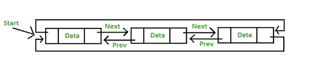
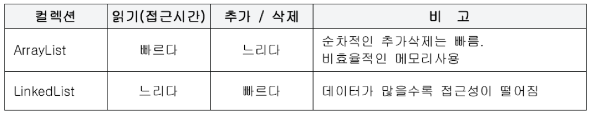
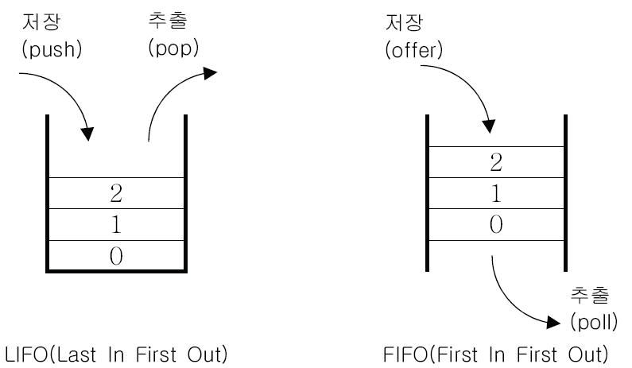
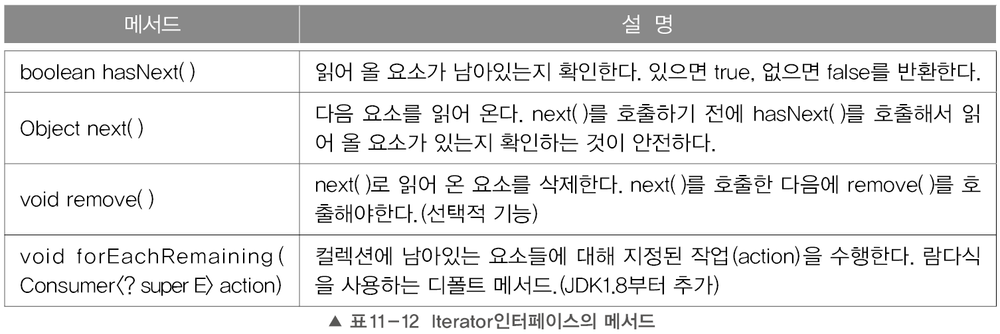

# 컬렉션 프레임웍

# 컬렉션 프레임웍(Collections Freamwork)

> 데이터 군을 저장하는 클래스들을 표준화한 설계 다수의 데이터(Collections)+표준화된 프로그래밍 방식(Framework)
>

## 컬렉션 프레임웍의 핵심 인터페이스



- List - 순서가 있는 데이터의 집함, 데이터의 중복 허용
    - ArrayList
    - LinkedList
    - Stack
    - Vector
- Set - 순서를 유지하지 않는 데이터의 집합, 데이터의 중복 허용 x
    - HashSet
    - TreeSet
- Map - 키(key)와 값(value)의 쌍으로 이루어진 데이터의 집합, 순서는 유지되지 않으며, 키는 중복을 허용하지 않고, 값은 중복을 허용한다.
    - HashMap
    - TreeMap
    - Hashtable
    - Properties

## Collection 인터페이스



## ArrayList

> List 인터페이스를 구현하기 때문에 데이터의 저장순서가 유지되고 중복을 허용한다는 특징을 가진다.
>

### 선언하기

```java
ArrayList list = new ArrayList(); // 타입 설정x Object로 사용
ArrayList<ArrayListDemo> demo = new ArrayList<ArrayListDemo>(); // 타입설정 ArrayListDemo 객체로 선언
ArrayList<Integer> i = new ArrayList<Integer>(); // int 타입으로 선언
ArrayList<Integer> i2 = new ArrayList<>(); // Integer 타입 사용
ArrayList<Integer> i3 = new ArrayList<Integer>(10); // 초기 용량 세팅
ArrayList<Integer> i4 = new ArrayList<Integer>(Arrays.asList(1, 2, 3, 4)); // 초기 값 세팅

ArrayList<String> s = new ArrayList<String>(); // String 타입 사용
ArrayList<Character> ch = new ArrayList<Character>(); // char 타입 사용
```

### 값 추가하기 add()

```java
ArrayList<String> al = new ArrayList<>();

		al.add("Hello");
		al.add("Hello");
		al.add(1, "World");

		System.out.print(al);
```

### ****값 변경하기 set(int index, Object)****

```java
ArrayList<String> al = new ArrayList<>();

		al.add("Hello");
		al.add("Hello");
		al.add("Hello");

		System.out.println("초기값 : " + al); // Hello Hello Hello

		al.set(1, "World");

		System.out.println("변경된 값 : " + al); // Hello World Hello
```

### ****값 삭제하기 remove()****

```java
ArrayList<String> al = new ArrayList<>();

		al.add("Hello");
		al.add("World");
		al.add("Hello");
		al.add("World");

		System.out.println("초기값 : " + al); //Hello World Hello World

		al.remove("Hello");

		System.out.println("1번 삭제 : " + al); //World Hello World

		al.remove(1);

		System.out.println("2번 삭제 : " + al); //Hello World

		al.clear();

		System.out.println("전체 삭제 : " + al); //
```

### 크기 구하기 - size()

### ****값 출력하기****

```java
//for 문
for (int i = 0; i < al.size(); i++) {
            System.out.print(al.get(i) + " ");
        }

  System.out.println();
//향상된 for문
for (String str : al)
    System.out.print(str + " ");

System.out.println();
//iterator
Iterator iter = al.iterator();
	while(iter.hasNext()){
	    System.out.print(iter.next() + " ");
	}
	}
```

### ****값 검색하기****

contains → 값이 있는지 없는디 true/false 반환

indexOf → 값이 어디있는지 index 반환 (없으면 -1)

```java
System.out.println("값 검색(contains) : " + al.contains("Hello"));
System.out.println("값 검색(indexOf) : " + al.indexOf("World"));
```

## LinkedList

이 클래스는 데이터가 연속된 위치에 저장되지 않고 모든 데이터가 데이터 부분과 주소 부분을 별도로 가지고 있다.

데이터는 포인터와 주소를 사용하여 연결한다.



위의 사진처럼 LinkedList는 데이터부분과 주소부분이 나눠져있어서 선으로 연결된 형태로 이어져있다.

### 데이터 삽입과 삭제





## doubly Linked list 이중 연결리스트



LinkedList는 단방향이기 때문에 이전 요소 접근이 어엽다. 이를 보환한게 이중 연결리스트이다.

```java
class Node{
	Node next;
	Node previous;
	Object obj;
}
```

### doubly circular linked list 이중원형 연결 리스트



마지막 요소의 다음요소가 첫번째 요소가 되고, 첫번째 요소의 이전 요소가 마지막 요소가 된다.

<aside>
💡 실제 LinkedList  클래스는 ‘더블 링크드 리스트’로 구현됨

</aside>

## ArrayList vs LinkedList



### Stack과 Queue



스택(Stack) : LIFO구조. 마지막에 저장된 것을 제일 먼저 꺼내게 된다. → ArrayList 로 구현

큐(Queue) : FIFO구조. 제일 먼저 저장한 것을 제일 먼저 꺼내게 된다. → LinkedList 로 구현

### PriorityQueue

Queue 인터페이스 구현체, 저장한 순서에 관계없이 우선순위(piority)가 높은 것부터 꺼내게 된다는 특징이 있다.

### Dequeu(Double-Ended Queue)

양쪽 끝에 추가/삭제가 가능하다. 스택+큐 → stack으로도 큐로도 사용 가능

## Iterator, ListIterator, Enumeration

컬렉션에 저장된 데이터를 접근하는데 사용되는 인터페이스

### Iterator

- 컬렉션에 저장된 요소들을 읽어오는 방법을 표준화한 것
- 컬렉션에 iterator()를 호출해서 Iterator를 구현한 객체를 얻어서 사용.



```java
Iterator iter = al.iterator();
	while(iter.hasNext()){
	    System.out.print(iter.next() + " ");
	}
}
```

- Map 인터페이스는 Key와 value가 쌍으로 저장되고 있어 직접 iterator()호출은 불가하고, keySet()이나 entrySet()과 같은 네서드로 각각 불러온 후 interator() 호출할 수 있다.

### ListIterator와 Enumeration

- Enumeration은 Iterator의 구버젼
- ListIterator는 Iterator의 접근성을 향상시킨 것 (단방향 → 양방향) (List 구현한 경우만)

## Arrays

출처

[https://crazykim2.tistory.com/558](https://crazykim2.tistory.com/558)