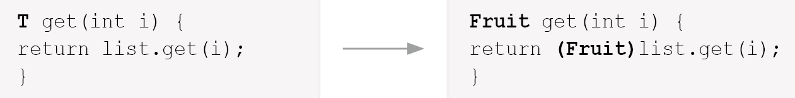

# 지네릭스, 열거형, 에너테이션

# 지네릭스

> 다양한 타입의 객체들을 다루는 메서드나
컬렉션 클래스에 컴파일 시의 타입체크를 해주는 기능
>
- 객체의 타입을 컴파일시에 체크하기 때문에 → 지네릭스의 장점

1. 타입의 안정성을 제공한다.
2. 타입체크와 형변환을 생략할 수 있으므로 코드가 간결해 진다.

**타입의 안정성 높인다는 것? 의도하지 않은 타입의 객체가 저장되는 것을 막고, 저장된 객체를 꺼내올 때 원래의 타입과 다른 타입으로 잘못 형변환되어 발생할 수 있는 오류를 줄여든다.

## 지네릭 클래스의 선언

```java
  class Box {
    Object item;

    void setItem(Object item) { this.item = item; }
    Object getItem() { return item; }
  }
```

위 클래스를 지네릭 클래스로 변경하려면 클래스 옆에 <T>를 붙인다.

T → 타입변수

```java
  class Box<T> {
    T item;

    void setItem(T item) { this.item = item; }
    T getItem() { return item; }
  }
```

E → Element(요소)

K → Key

V → Value

이런 지네릭 T와같은 기호들은 그냥 기호의 종류만 다를 뿐 ‘임의의 참조형 타입'을 의미하는것은 모두 같다.


> Box<T> 지네릭 클래스. ‘T의 Box’ 또는 ‘T Box’ 라고 읽는다.
T 타입 변수 또는 타입 매개변수(T는 타입 문자)
Box 원시타입(raw type)
>

클래스를 생성할때는 참조변수와 생성자에 타입 T대신 사용될 실제 타입을 지정해주어야 한다.

```java
Box<String> box=new Box<String>(); // 타입 T 대신, 실제 타입 지정
b.setItem(new Object()); // Error. String이외의 타입 지정 불가
b.setItem("ABC"); // OK. String타입이므로 가능
String item = b.getItem(); // 형변환 필요없음
```

```java
//그럼 T값이 String으로 바뀐다.
class Box {
    String item;

    void setItem(String item) { this.item = item; }
    String getItem() { return item; }
  }
```

지네릭스는 JDK1.5도입되었기 때문에 도입되기 이전의 코드와 호환성을 유지하기 위해서 예전 방식으로 객체 생성이 가능하다. → Box b=new Box();
하지만 제네릭 타입을 지정하지 않아 안전하지 않다는 경고가 발생한다.
Object를 지정하면, 타입을 지정하지 않은 것이 아니라 알고 적은것이므로 경고는 잘생하지 않는다

## 제네릭스 제한

제네릭 클래스의 객체를 생성할 때, 객체별로 다른 타입을 지정하는 것은 괜찮다. 그러나 모든 객체에 대해 동일하게 동작해야하는 static멤버에는 타입 변수 T를 사용할 수 없다. T는 인스턴스변수로 간주되기 때문이다. static멤버는 대입된 타입의 종류에 관계없이 동일한 것이어야 한다.

제네릭 타입의 배열을 생성하는 것도 허용되지 않는다. 제네릭 배열 타입의 참조변수를 선언하는 것은 가능하지만, `new T[10]`과 같이 배열을 생성하는 것은 안된다.

생성할 수 없는 이유는 new연산자 때문인데, 이 연산자는 컴파일 시점에 타입 T가 무엇인지 정확히 알아야 한다. instanceof연산자도 같은 이유로 T를 피연산자로 사용할 수 없다.

## 제네릭 클래스의 객체 생성과 사용

```java
  class Box<T> {
    ArrayList<T> list = new ArrayList<T>();

    void add(T item) { list.add(item); }
    T get(int i) { return list.get(i); }
    ArrayList<T> getList() { return list; }
    int size() { return list.size(); }
    public String toString() { return list.toString(); }
  }
```

  Box<T>의 객체에는 한 가지 종류, T타입의 객체만 저장할 수 있다.

Box<T>의 객체를 생성할 때, 참조변수와 생성자에 대입된 타입(매개변수화된 타입)이 일치해야 한다. 일치하지 않으면 에러가 발생한다. 두 타입이 상속관계에 있어도 에러 발생

하지만, 두 제네틱 클래스 타입이 상속관계에 있고, 대입된 타입이 같은 것은 괜찮다.

## 제한된 제네릭 클래스

타입 문자로 사용할 타입을 명시하면 한 종류의 타입만 저장할 수 있도록 제한할 수 있지만,  여전히 모든 종류의 타입을 지정할 수 있다. → 제한 할 수 있는 방법은?

여기서 지네릭 타입에 ‘extends’를 사용하면, 특정 타입의 자손들만 대입할 수 있게 제한할 수 있다.

조상타입의 참조변수로 자손타입의 객체를 가리킬 수 있는 것처럼, 매개변수화된 타입의 자손 타입도 가능하다.

클래스가 아니라 인터페이스를 구현해야 한다는 제약에도 ‘extends’를 사용한다. → ‘implements’ 사용 안함을 주의

클래스의 자손이면서 인터페이스도 구현해야한다면 ‘&’ 기호를 이용해 연결한다.

`class Example<T extends classname & interfacename> { ... }`

## 와일드 카드

제네릭 클래스가 아닌 클래스에 static 메서드의 매개변수로 특정 타입을 지정했을 때, 제네릭 타입을 특정 타입으로 고정해 놓으면 다른 타입의 객체가 메서드의 매개변수가 될 수 없으므호 여러가지 매개변수를 갖는 메서드를 만들어야 한다.

그러나 이와 같이 오버로딩하면, 컴파일 에러가 발생한다. → **제네릭 타입이 다른 것만으로는 오버로딩이 성립되자 않아서**! → 제네릭타입은 컴파일러가 컴파일할때만 사용하고 제거해버린다. 따라서, 위 경우 오버로딩이 아닌 **메서드 중복 정의**가 된다.

이럴 때 사용하기 위해 고안된 것이 와일드 카드 ?, 어떠한 타입도 될 수 있다.

`?`만으로는 Object타입과 다를 게 없으므로, 다음과 같이 상한(upper bound)과 하한(lower bound)을 제한할 수 있다.

> **< ? extends T >**
와일드 카드의 상한 제한. T와 그 자손들만 가능
**< ? super T >**
와일드 카드의 하한 제한. T와 그 조상들만 가능
**< ? >**
제한 없음. 모든 타입이 가능. < ? extends Object > 와 동일(raw type)
>

## 제네릭 메서드

메서드 선언부에 제네릭 타입이 선언된 메서드를 제네릭 메서드라고 한다.

`Collections.sort()`는 제네릭 메서드이며, 제네릭 타입의 선언 위치는 반환 타입 바로 앞이다.

```java
  class FruitBox<T> {
      ...
    static <T> void sort(List<T> list, Comparator<? super T> c) {
      ...
    }
  }
```

제네릭 클래스에 정의된 타입 매개변수와 제네릭 메서드에 정의된 타입 매개변수는 별개의 것이다. 같은 타입 문자 T를 사용해도 같은 것이 아니다.

sort()가 static메서드이므로 타입 매개변수를 사용할 수 없지만, 메서드에 제네릭 타입을 선언하고 사용하는 것은 가능하다. → 메서드에 선언된 제네릭 타입은 지역 변수를 선언한 것과 같다고 생각하면 된다. 이 타입 매개변수는 메서드 내에서만 지역적으로 사용될 것이므로 메서드가 static이건 아니건 상관이 없다.

```
  FruitBox<Apple> fruitBox = new FruitBox<Apple>();
    ...
  System.out.println(FruitBox.<Apple>genericMethod(fruitBox));
  System.out.println(Example.genericMethod(genericClass)); // 대입된 타입 생략

// 생략 불가능하면 참조변수나 클래스이름 생략할 수 없다.
  System.out.println(<Exam>genericMethod(genericClass)); // Error-클래스이름 생략불가
  System.out.println(this.<Exam>genericMethod(genericClass)); // OK
  System.out.println(Example.<Exam>genericMethod(genericClass)); // OK
```

제네릭 메서드를 호출할 때는 타입 변수에 타입을 대입해야 한다. → 대부분 컴파일러가 타입 추정 생략 가능

주의해야 할 점은 제네릭 메서드를 호출할 때, 대입된 타입을 생략할 수 없는 경우에는 참조변수나 클래스 이름을 생략할 수 없다.

복잡하게 선언된 제네릭 메서드의 예시 추가로 봐보자.


1. 타입 T를 요소로 하는 List 매개변수로 허용한다.
2. ‘T’는 Comparable을 구현한 클래스이어야 하며(`<T extends Comparable>`), ‘T’ 또는 그 조상의 타입을 비교하는 Comparable이어야한다는 것(`Comparable<? super T>`)을 의미한다. 예를 들어, T가 Student이고, Person의 자손이라면, `<? super T>`는 Student, Person, Object가 모두 가능하다.

## 제네릭 타입의 형변환

지네릭 타입과 넌제네릭 타입간의 형변환은 항상 가능하다. 다만 경고 발생!


반면 대입된 타입이 다른 제네릭 타입간에는 형변환은 불가능하다.

`Gen<Object> objGen = new Gen<String>(); // Error. 형변환 불가능`

와일드 카드가 사용된 지네릭 타입으로는 형변환 가능

`Gen<? extends Object> wGen = new Gen<String>();`

## 제네릭 타입의 제거

컴파일러는 제네릭 타입을 이용해서 소스파일 체크, 필요한 곳에 형변환 넣어줌 → 제네릭 타입 제거 → .class파일에는 제네릭 타입 없음!

제네릭 타입의 기본적인 제거과정

1. 제네릭 타입의 경계(bound)를 제거한다.
제네릭 타입이 라면 T는 Fruit로 치환된다. 인 경우 Object로 치환된다. 그리고 클래스 옆의 선언은 제거된다.


1. 제거한 후 타입이 일치하지 않으면, 형변환을 추가한다.
List의 get()은 Object타입을 반환하므로 형변환이 필요하다.


1. 와일드 카드가 포함된 경우, 적절한 타입으로 형변환 추가


** 향상된 for문을 컴파일하면 iterator와 while조합으로 코드 최적화됨 **

# enum

열거형은 서로 관련된 상수를 편리하게 선언하기 위한 것으로 여러 상수를 정의할 때 사용하면 유리하다. JDK1.5 도입

자바의 열거형은 열거형이 갖는 값 + 타입도 관리하기 때문에 보다 논리적인 오류를 줄일 수 있다.

```
class Card {
    static final int CLOVER = 0;
    static final int HEART = 1;
    static final int DIAMOND = 2;
    static final int SPADE = 3;

    static final int ACE = 0;
    static final int TWO = 1;
    static final int THREE = 2;
}
```

```
class Card {
    enum Kind { CLOVER, HEART, DIAMOND, SPADE }
    enum Value { ACE, TWO, THREE }

		final Kind kind;
		final Value value;
}
```

## 열거형의 정의와 사용

`enum 열거형이름 { 상수명1, 상수명2, ... }`

- 정의된 상수를 사용하는 방법은 ‘열거형이름.상수명'이다. 클래스의 static 변수 참조하는것과 동일


- 열거형 상수의 비교에 ==와 compareTo() 사용가능

### 멤버 추가하기

열거형 상수의 값이 불연속적인 경우 열거형 상수의 이름 옆에 원하는 값을 괄호()와 함께 적어준다.

열거형의 생성자는 묵시적으로 private이므로, 외부에서 객체생성 불가

```java
enum Direction{
	EAST(1,">"), SOUTH(2,"V"), WEST(3,"<"), NORTH(4,"^");

	private final int value;
	private final String symbol;

	Direction(int value, String symbol){//private가 생략되어 있음
		this.value=value;
		this.symbol=symbol;
	}
}
```

## 열거형의 이해

열거형 Firection이 아래와 같이 선언되어 있을 때,


열거형 Direction은 아래와 같은 클래스로 선언된 것과 유사하다.


## enum이 제공하는 메서드 - java.lang.Enum

Enum클래스를 상속받는다. Enum클래스에서 정의된 메서드를 사용할 수 있다.

```
public final String name()
public final int ordinal()
public String toString()
public final boolean equals(Object obj)
public final int hashCode()
public int compareTo(E obj)
public static <T extends Enum> T valueOf(Class enumType,String name)
public final Class <E> getDeclaringClass() // enum 객체의 타입 반환
public final Object clone() throws CloneNotSupportedException
protected final void finalize()
```

- **name( )**
    - 열거형 상수의 이름을 문자열로 반환한다.
- **ordinal( )**
    - 열거형 상수가 정의된 순서(0부터 시작)를 정수로 반환한다.
- **toString( )**
    - 열거형 상수의 이름을 문자열로 반환한다.
- **compareTo( )**
    - 정렬의 기준을 위한 메서드로 비교 대상보다 순서가 빠르면 -1, 같으면 0, 느리면 1을 반환한다.
- **valueOf(enumType, name)**
    - 지정된 열거형에서 name과 일치하는 열거형 상수를 반환한다.
- **getDeclaringClass( )**
    - 열거형의 Class 객체를 반환한다.
- **values( )**
    - 열거형의 모든 상수를 배열에 담아 반환한다.


# 애너테이션(annotation)

프로그램의 소스코드 안에 다른 프로그램을 위한 정보를 미리 약속된 형식으로 포함시킨 것이 애노테이션이다. 주석(comment)처럼 프로그래밍 언어에 영향을 미치지 않으면서 유용한 정보를 제공하는 기능인 것이다.

애노테이션은 JDK에서 기본적으로 제공하는 것과 다른 프로그램에서 제공하는 것들이 있는데, 어느 것이든 약속된 형식으로 정보를 제공하기만 하면 된다.

JDK에서 제공하는 표준 애노테이션은 주로 컴파일러를 위한 것으로 컴파일러에게 유용한 정보를 제공한다. 그리고 새로운 애노테이션을 정의할 때 사용하는 메타 애노테이션을 제공한다.

## 표준 애너테이션

자바에서 기본적으로 제공하는 애너테이션들은 몇 개 없다. 그나마 이들의 일부는 ‘매타 애너테이션'으로 애너테이션을 정의하는데 사용되는 애너테이션의 애너테이션이다.


### @Override

- 메서드 앞에서만 붙일 수 있는 애노테이션으로, 조상의 메서드를 오버라이팅 하는 것이라는 사실을 컴파일러에게 알려주는 역할을 한다.
- 컴파일러가 같은 이름의 메서드가 조상에 있는지 확인해주기 때문에 실수 방지 → 붙이는 것이 좋다.

### @Deprecated

새로운 버전 JDK가 소개될 때, 새로운 기능이 추가되면서 기존의 부족했던 기능이 개선됨 → 대체할 수 있는 새로운 기능이 추가되었으니 기존의 기능은 어떻게 되는 것? → 이미 사용되는곳이 많아 삭제 불가

@Deprecated는 이런 더 이상 사용되지 않는 필드나 메서드에 붙이는 애노테이션이다. 이 애너테이션이 붙은 대상은 다른 것으로 대체되었으니 더 이상 사용하지 않는 것을 권한다는 의미이다.

### @FunctionalInterface

함수형 인터페이스를 선언할 때, 이 애노테이션을 붙이면 컴파일러가 함수형 인터페이스를 올바르게 선언했는지 확인하고, 잘못된 경우 에러를 발생시킨다. 필수는 아니지만. 붙이면 실수를 방지할 수 있으므로 사용하는 것을 권장한다.

### @SuppressWarning

컴파일러가 보여주는 경고메시지가 나타지아 않도록 억제해주는 애노테이션이다.

컴파일러의 경고메시지는 무시하고 넘어갈 수 있지만, 확인하고 해결해서 컴파일 후에 어떠한 메시지도 나타나지 않도록 하는 것이 좋다.

그러나 경우에 따라 경고가 발생할 것을 알지만 그냥 놔둘 때가 있는데, 이럴 경우 컴파일을 할 때마다 메시지를 보게된다. → @SuppressWarning 붙이면 안보임!

`@SuppressWarnings`로 억제할 수 있는 경고 메시지의 종류는 다양한데, JDK 버전이 올라가면서 계속 추가될 것이다. 이 중 주로 사용되는 것은 `deprecation`, `unchecked`, `rawtypes`, `varargs` 정도이다.

## 메타 애너테이션

> 애너테이션을 위한 애너테이션
>

즉 애너테이션에 붙이는 애너테이션으로 애너테이션을 정의할 때 애너테이션의 적용대상(target)이나 유지기간(reteation)등을 지정하는데 사용된다. `java.lang.annotation` 패키지에 포함되어 있다.

### @target

애너테이션이 적용 가능한 대상을 지정하는데 사용한다. 여러개의 값을 지정할 때는 배열에서처럼 괄호{}를 사용해야한다.


### @retention

애노테이션이 유지(retention)되는 기간을 지정하는데 사용된다.

애너테이션은 사용 용도에 따라 @AnnotationName을 어느 범위까지 유지할 것인지 지정해야 한다. 이러한 유지정책은 `java.lang.annotation.RetentionPolicy`열거 상수로 아래와 같이 정의된다.


### **@documented**

`@Documented`는 애너테이션에 대한 정보가 javadoc으로 작성한 문서에 포함되도록한다. 자바에서 제공하는 기본 애너테이션 중애서 `@Override`와 `@SuppressWarnings`을 제외하면 모두 `@Documented`가 붙어 있다.

### @Inherited

애너테이션을 자손 클래스에 상속하고자 할 때, @Inherited를 붙인다.

### @Repeatable

반복해서 붙일 수 있는 애너테이션을 정의할 때 사용

@Repeatable이 붙은 애너테이션은 반복해서 붙일 수 있다.

### @Native

Native method에 의해 참조되는 ‘상수 필드'에 붙이는 애너테이션

## **애노테이션 타입 정의하기**

‘@’기호를 붙이는 것을 제외하면 인터페이스를 정의하는 것과 동일

```java
@interface 애노테이션이름 {
    타입 요소이름();  // 애노테이션의 요소를 선언.
      ...
}
```

### 애너테이션의 요소

애너테이션 내에 선언된 메서드를 애너테이션의 요소라고 한다. 애노테이션에도 인터페이스 처럼 상수를 정의할 수 있지만, 디폴트 메서드를 정의 할 수 없다.

- 요소의 타입은 기본형, String, enum, 애노테이션, Class만 허용된다.
- ( )안에 매개변수를 선언할 수 **없다.**
- 예외를 선언할 수 없다.
- 요소를 타입 매개변수로 정의할 수 없다.

애노테이션의 요소는 반환값이 있고 매개변수는 없는 추상 메서드의 형태를 가지며, 상속을 통해 구현하지 않아도 된다.

```java
public @interface AnnoEx_01 {
    int num();
    String str();
    String[] strArr();
}
```

애노테이션의 각 요소는 기본값을 가질 수 있으며, 기본값이 있는 요소는 애노테이션을 적용할 때 값을 지정하지 않으면 기본값이 사용된다. 이 때 기본값으로 null을 제외한 모든 리터럴이 사용된다.

```java
@interface TestAnno {
    int count() default 1;
}

@TestAnno   // @TestAnno(count = 1)과 동일
public class NewClass { ... }
```

애노테이션 요소가 하나뿐이고 이름이 value인 경우, 애노테이션을 적용할 때 요소의 이름을 생략하고 값만 적어도 된다.

```java
@interface TestAnno {
    String value();
}

@TestAnno("java") // @TestAnno(value = "java")
class NewClass { ... }
```

요소의 타입이 배열인 경우, 괄호 { }를 사용해서 여러 개의 값을 지정할 수 있다. 기본값을 지정할 때도 괄호 { }를 사용할 수 있다.

```java
@interface TestAnno {
    String[] strArr();
}

@Test(strArr = {"One", "Two"})  // 값이 여러 개인 경우
@Test(strArr = "Three")         // 값이 하나일 때는 괄호 생략 가능
@Test(strArr = {})              // 값이 없을 때는 생략 불가능
```

```java
@interface TestAnno {
    String[] strArr_1() default {"A is a", "B is b"};   // 기본 값이 여러 개인 경우
    String[] strArr_2() default "C is c";               // 기본 값이 하나인 경우
}

@TestAnno
class NewClass { ... }
```

## 마커 애노테이션 Marker Annotation

값을 지정할 필요가 없는 경우, 애노테이션의 요소를 하나도 정의하지 않을 수 있다. 이렇게 요소가 하나도 정의되지 않은 애노테이션을 마커 애노테이션이라고 한다.

```java
@Target(ElementType.METHOD)
@Retention(RetentionPolicy.SOURCE)
public @interface Test { }    // 마커 애노테이션. 정의된 요소가 하나도 없다.
```